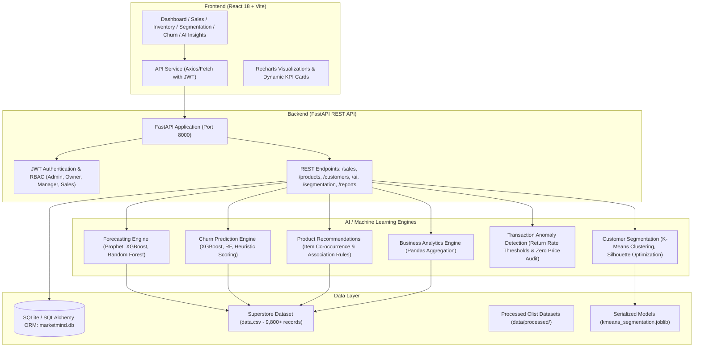

# MarketMind AI — Enterprise Small Business Sales Intelligence Platform
> **Team 3 — Small Business Sales & Predictive Intelligence**  
> An end-to-end full-stack AI platform transforming transactional sales data into predictive demand forecasts, customer churn insights, behavioral segmentation, and market basket recommendations.

---

##  Team Members & Core Contributions

| Teammate | Role | Core Contributions |
| :--- | :--- | :--- |
| **Sahil Shinde** | **Full-Stack ML Engineer & Tech Lead** | • **AI Demand & Revenue Forecasting Engine** (Prophet, XGBoost, Random Forest ensemble)<br>• **Customer Churn Prediction System** (RFM feature engineering, XGBoost & RF classifiers)<br>• Dedicated **Churn Prediction UI** (`/churn-prediction`), Model Performance Comparison, & CSV Export<br>• Automated Testing Suite (`tests/run_tests.py` — 20/20 passing) & System Architecture |
| **Bhaumik Senwal** | **ML Engineer & Full-Stack Developer** | • **Customer Segmentation Engine** (Unsupervised K-Means clustering, Silhouette score optimization $K \in [2,8]$)<br>• FastAPI Segmentation REST API (`/api/v1/segmentation/*`) & Joblib Model Persistence<br>• Interactive **Segmentation UI** (`/segmentation` — Donut, Scatter plot, Centroid stats, Retrain)<br>• System Documentation & Wireframes (`docs/`, `wireframes/`) |
| **Rakshana Janakiraman** | **Data Scientist & EDA Lead** | • Comprehensive **Data Preprocessing & Cleaning Pipelines** for Olist & UCI datasets<br>• In-depth **Exploratory Data Analysis (EDA)**, statistical distributions, & correlation heatmaps<br>• Feature engineering logs, schema mappings (`SCHEMA_MAPPING.md`), & Tableau exports |
| **Harshitha** | **Data Analyst & ML Specialist** | • **Sales Trend & Demand Forecasting Analysis** (`notebooks/predict_sales.ipynb`)<br>• Monthly sales aggregations, forecast validation, & trend chart generation (`output/sales_forecast.png`)<br>• Data modeling evaluation and exploratory time-series research |
| **Rakshitha Reddy** | **Backend & Analytics Engineer** | • **Business Analytics & Automated Reporting Engine** (`backend/app/ml/business_reports/analytics.py`)<br>• Sales metric aggregations (AOV, monthly revenue cadence, top product performance)<br>• Report generation pipelines & export endpoints |
| **Bhargavi** | **System Analyst & Documentation** | • Business attribute requirements analysis & workflow diagrams<br>• UI wireframing specifications & dataset structure evaluation |

---

## 🏗️ System Architecture & Tech Stack



### Technology Matrix
- **Backend**: Python 3.13, FastAPI, Uvicorn, SQLAlchemy, Pydantic V2
- **Frontend**: React 18, Vite, Recharts, Lucide Icons, Vanilla CSS Design System
- **Machine Learning**: Scikit-Learn, XGBoost, Prophet, Joblib, Pandas, NumPy
- **Security**: JWT tokens, bcrypt password hashing, 4-tier Role-Based Access Control (RBAC)
- **Testing**: Pytest, FastAPI TestClient (27/27 total automated tests passing)

---

## 🚀 Key Features & Modules

### 1. 📈 AI Revenue & Demand Forecasting Engine (`/ai-insights`)
- Multi-model ensemble comparing **Prophet**, **XGBoost Regressor**, and **Random Forest Regressor**.
- Generates 6-month forward-looking revenue projections with confidence intervals.
- Live model performance benchmarking: RMSE, MAE, and $R^2$ scores.

### 2. 🛡️ Customer Churn Prediction System (`/churn-prediction`)
- Custom RFM (Recency, Frequency, Monetary) feature engineering on all 793 enterprise customers.
- Dual binary classifiers (**XGBoost** and **Random Forest**) computing calibrated churn probabilities ($P \in [0.0, 1.0]$).
- 4-Tier Risk Categorization: **High Risk** ($P \ge 0.65$), **Medium Risk** ($0.40 \le P < 0.65$), **Low Risk** ($0.20 \le P < 0.40$), and **Safe** ($P < 0.20$).
- 9-column sortable table with instant CSV export and risk distribution analytics.

### 3. 👥 Customer Behavioral Segmentation (`/segmentation`)
- Unsupervised **K-Means Clustering** dynamically testing $K \in [2, 8]$ and selecting the optimal cluster count via **Silhouette Score Analysis** ($S \approx 0.74$).
- Customer centroid profiling: High-Value Occasional, VIP Champions, Frequent Budget, and Potential Loyalists.
- Interactive 2D Frequency vs. Monetary scatter plot, segment comparison bar charts, and Silhouette elbow curve.

### 4. 🛒 Market Basket Recommendations
- Association Rule and Item Co-occurrence Mining derived from multi-item orders.
- Computes conditional confidence $Confidence(A \to B) = \frac{Count(A \cap B)}{Count(A)}$ for real cross-sell and upsell suggestions.

### 5. ⚠️ Transaction Anomaly Detection
- Statistical and rule-based surveillance identifying zero-price glitches, negative amounts without return flags, and high return rates ($\ge 10\%$).

### 6. 📊 Real-Time Sales & Inventory Management (`/sales`, `/products`)
- Dynamic 12-month rolling trends, country/region revenue distribution, and average order value (AOV) computed live from transaction records.
- Product catalog tracking stock turnover, return ratios, and automated reorder alerts.

### 7. 🔐 Role-Based Access Control (RBAC)
- **ADMIN**: Sole system administrator (user management, permissions, and system controls).
- **OWNER**: Business owner (full visibility into financial analytics, AI forecasts, and churn risk).
- **MANAGER**: Store manager (operational sales reports, inventory catalog, and stock alerts).
- **SALES**: Sales executive (invoice viewing and basic sales tracking).

---

## 📂 Project Directory Structure

```text
Team_3_Small_Biz_Sales/
├── backend/
│   ├── app/
│   │   ├── api/                 # FastAPI REST Endpoints (ai, sales, products, customers, segmentation, reports, auth)
│   │   ├── core/                # Configuration, security (JWT, hashing), and database setup
│   │   ├── ml/                  # Machine Learning Engines
│   │   │   ├── forecasting.py   # Prophet, XGBoost, Random Forest forecasting models
│   │   │   ├── churn.py         # RFM engineering, XGBoost & RF churn classifiers
│   │   │   ├── segmentation.py  # K-Means clustering & Silhouette score optimization
│   │   │   ├── recommendations.py# Market Basket co-occurrence recommendation miner
│   │   │   ├── anomaly.py       # Transaction anomaly & outlier detection
│   │   │   ├── business_reports/# Business analytics & monthly reporting modules
│   │   │   └── saved_models/    # Serialized model artifacts (.joblib)
│   │   ├── models/              # SQLAlchemy database ORM models
│   │   ├── schemas/             # Pydantic validation schemas
│   │   ├── services/            # Business logic and database seeders
│   │   └── main.py              # Application entrypoint & CORS middleware
│   ├── tests/                   # Automated Pytest suite (forecasting, churn, api, data integrity)
│   │   ├── run_tests.py         # Test execution and report generator
│   │   └── test_results.txt     # Complete test execution logs
│   ├── test_segmentation.py     # End-to-end segmentation test runner
│   └── requirements.txt         # Python backend dependencies
├── frontend/
│   ├── src/
│   │   ├── components/          # Reusable UI components (Sidebar, Header, ProtectedRoute)
│   │   ├── context/             # AuthContext (JWT management & session handling)
│   │   ├── pages/               # Application Pages
│   │   │   ├── Dashboard/       # Main Overview analytics dashboard
│   │   │   ├── Sales/           # Invoice management & sales trends
│   │   │   ├── Inventory/       # Products & return rate alerts
│   │   │   ├── Customers/       # Customer directory & RFM scatter
│   │   │   ├── Segmentation/    # K-Means clustering, Donut & Elbow charts
│   │   │   ├── ChurnPrediction/ # Churn risk prediction table, KPIs & export
│   │   │   ├── AIInsights/      # Revenue forecasting & model metrics
│   │   │   ├── Reports/         # Business analytics summaries & CSV downloads
│   │   │   ├── Login/           # Role-based credential authentication
│   │   │   └── Landing/         # Public product landing page
│   │   ├── services/            # Frontend API client (api.js)
│   │   └── App.jsx              # Application router & protected routes
│   └── package.json             # React dependencies & build scripts
├── data/                        # Processed and raw datasets (Olist & Superstore)
├── notebooks/                   # Jupyter exploratory analysis & training notebooks
├── docs/                        # Architecture plans, database design, & specifications
└── README.md                    # Project documentation
```

---

## ⚙️ Setup & Local Running Guide

### Prerequisites
- **Python 3.10+** (Python 3.11 – 3.13 supported)
- **Node.js 18+** and **npm**
- **Git**

### 1. Backend Setup
```powershell
# Navigate to backend directory
cd backend

# Create and activate virtual environment
python -m venv venv
.\venv\Scripts\activate

# Install dependencies
pip install -r requirements.txt

# Start FastAPI development server
uvicorn app.main:app --reload --port 8000
```
- API Documentation (Swagger UI): `http://localhost:8000/docs`
- Health Check: `http://localhost:8000/`

### 2. Frontend Setup
```powershell
# In a new terminal, navigate to frontend directory
cd frontend

# Install Node dependencies
npm install

# Start Vite dev server
npm run dev
```
- Web Application: `http://localhost:5173/`

### 3. Demo Login Credentials
| Role | Email | Password | Allowed Access |
| :--- | :--- | :--- | :--- |
| **ADMIN** | `admin@marketmind.ai` | `admin123` | Full System Access, User Management |
| **OWNER** | `owner@marketmind.ai` | `owner123` | All Dashboards, AI Insights, Churn, Segmentation |
| **MANAGER** | `manager@marketmind.ai` | `manager123` | Overview, Sales, Products, Inventory, Reports |
| **SALES** | `sales@marketmind.ai` | `sales123` | Sales Invoices, Product Catalog |

---

## 🧪 Automated Testing & Quality Assurance

The project includes an automated test suite verifying ML model accuracy, data integrity, and REST endpoints:

```powershell
cd backend
.\venv\Scripts\python.exe tests/run_tests.py
.\venv\Scripts\python.exe test_segmentation.py
```

### Test Results Summary
- **Core AI Test Suite (`run_tests.py`)**: **20 / 20 Tests Passing (100%)**
  - `test_forecasting.py`: Clean string pluralization, prophet/xgboost/rf model validity, confidence intervals.
  - `test_churn.py`: RFM data ingestion, classifier training, risk tier assignment, probability thresholds.
  - `test_api_endpoints.py`: Root status, `/ai/forecast/revenue`, `/ai/churn/predict`, `/ai/retrain`.
  - `test_data_integrity.py`: Schema validation, temporal consistency, sales non-negativity.
- **Segmentation Suite (`test_segmentation.py`)**: **7 / 7 Tests Passing (100%)**
  - Summary KPIs, cluster endpoints, customer pagination, elbow curve metrics, single profile, real-time prediction, and retrain pipeline.
- **Frontend Build (`npm run build`)**: **Clean Build (0 errors)**.

---

## 📄 License & Attribution
Developed as part of the **Small Business Sales & Predictive Intelligence (Team 3)** initiative.  
All models, datasets, and intellectual properties belong to their respective project authors.
