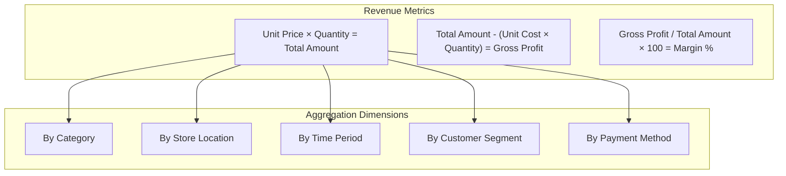
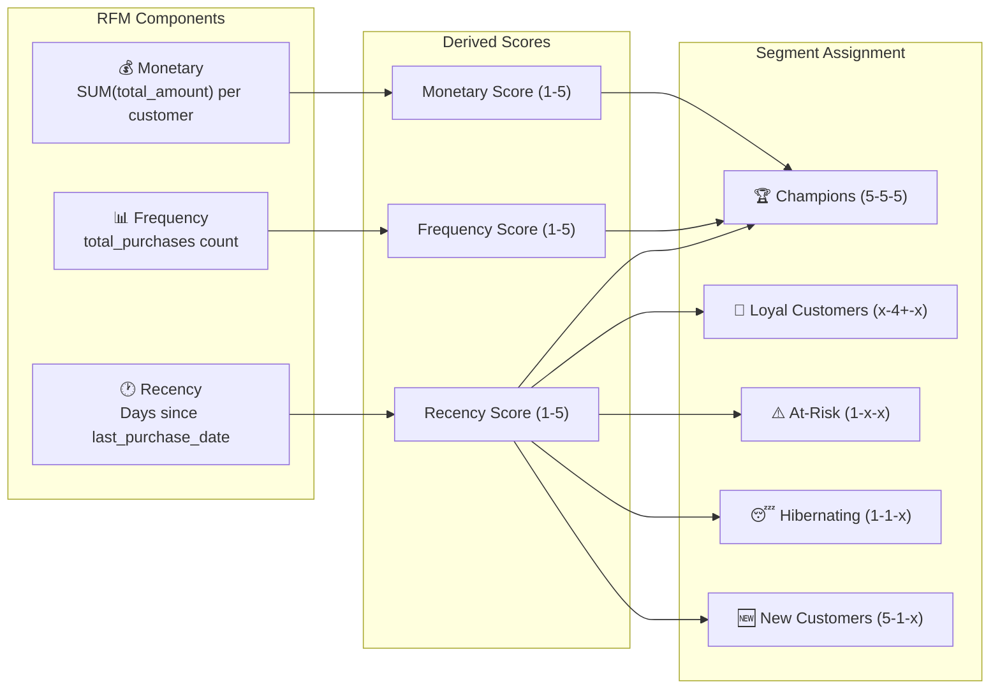
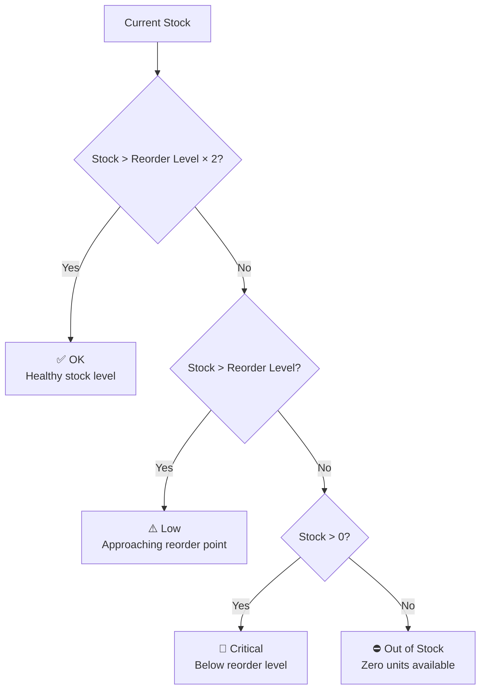
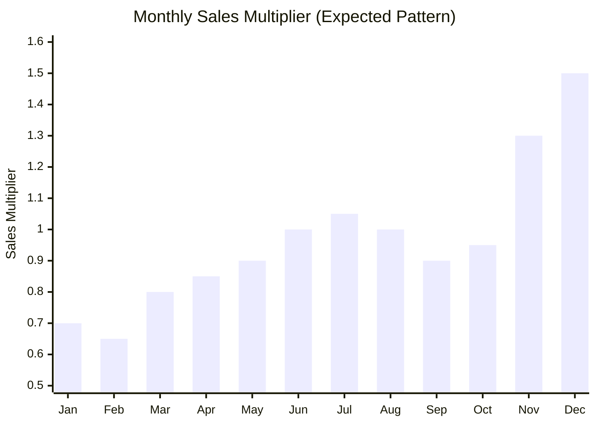
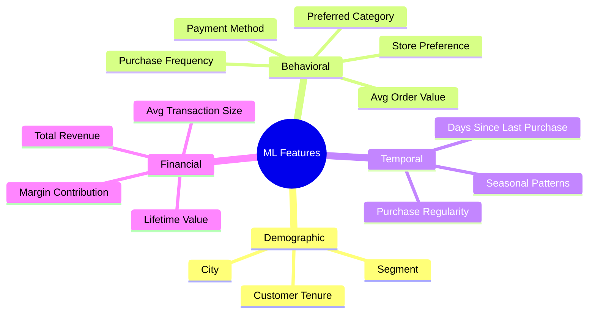
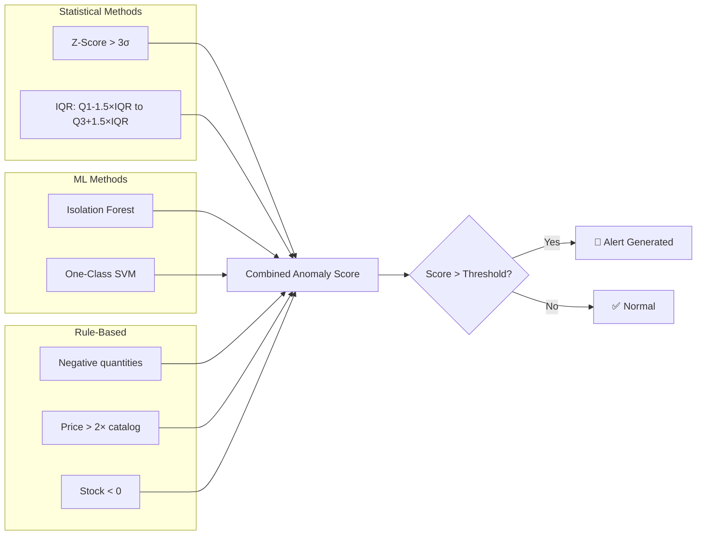

# MarketMind AI — Business Attributes Analysis

## 1. Overview

This document analyzes the business-relevant attributes across all four datasets, identifying which attributes drive revenue, customer behavior, inventory decisions, and feed into the AI/ML modules. Each attribute is evaluated for its analytical significance and mapped to the MarketMind AI module that consumes it.

---

## 2. Revenue-Driving Attributes

These attributes directly impact revenue calculation, profitability analysis, and financial reporting.

| Attribute | Dataset | Type | Business Significance | Analytics Use |
|-----------|---------|------|----------------------|---------------|
| `unit_price` | products, sales | Decimal | Base selling price; determines revenue per unit | Pricing analysis, revenue calculation |
| `unit_cost` | products, inventory | Decimal | Cost of goods sold (COGS); determines margin | Profitability analysis, margin reporting |
| `margin_pct` | products | Decimal | Gross profit margin per product | Product profitability ranking |
| `quantity` | sales | Integer | Units sold per transaction | Volume analysis, demand patterns |
| `total_amount` | sales | Decimal | Transaction revenue (price × quantity) | Revenue aggregation, KPI dashboards |
| `payment_method` | sales | String | Payment channel preference | Payment analytics, processing fee optimization |

### Revenue Analysis Framework

### Key Insights

- **Category-level margins**: Clothing has highest margins (45–70%), Groceries lowest (25–45%)
- **Price distribution**: Wide range from $0.99 (Groceries) to $1,299.99 (Electronics) — requires log-scale analysis
- **Discount impact**: ~10% of transactions include price reductions (5%–25% off), trackable by comparing `unit_price` in transactions vs. products

---

## 3. Customer Behavior Indicators

Attributes that reveal purchasing patterns, customer lifecycle, and engagement levels.

| Attribute | Dataset | Type | Business Significance | Analytics Use |
|-----------|---------|------|----------------------|---------------|
| `customer_id` | customers, sales | String | Customer identity linkage | Purchase history tracking |
| `segment` | customers | String | Pre-assigned customer tier | Segment-based analytics |
| `total_purchases` | customers | Integer | Lifetime purchase frequency | Customer value ranking |
| `last_purchase_date` | customers | Date | Recency of engagement | Churn risk indicator |
| `join_date` | customers | Date | Customer acquisition date | Cohort analysis, tenure |
| `city` | customers | String | Geographic location | Regional performance analysis |

### RFM (Recency, Frequency, Monetary) Framework

The dataset supports full RFM analysis — the cornerstone of customer segmentation:

### Customer Segment Distribution

| Segment | Weight | Count (est.) | Characteristics |
|---------|--------|-------------|-----------------|
| Premium | 10% | ~50 | High frequency, high value, recent purchases |
| Regular | 35% | ~175 | Consistent moderate purchases |
| Occasional | 25% | ~125 | Infrequent, lower value purchases |
| New | 20% | ~100 | Recently joined, limited history |
| At-Risk | 10% | ~50 | Declining frequency, potential churn |

---

## 4. Inventory Management Signals

Attributes critical for stock management, reorder optimization, and supply chain decisions.

| Attribute | Dataset | Type | Business Significance | Analytics Use |
|-----------|---------|------|----------------------|---------------|
| `current_stock` | inventory | Integer | Units available for sale | Stock level monitoring |
| `reorder_level` | inventory | Integer | Minimum stock threshold | Automated reorder triggers |
| `supplier` | inventory | String | Supply chain partner | Supplier performance analysis |
| `warehouse_location` | inventory | String | Physical storage location | Warehouse utilization |
| `last_restocked` | inventory | Date | Days since last restocking | Replenishment frequency |
| `category` | inventory | String | Product grouping | Category-level stock analysis |

### Stock Status Classification

### Inventory KPIs

| KPI | Formula | Business Value |
|-----|---------|---------------|
| **Stock Turnover Rate** | Units Sold / Average Stock | How quickly inventory moves |
| **Days of Supply** | Current Stock / Avg Daily Sales | How long stock will last |
| **Stockout Rate** | Products at 0 / Total Products | Supply chain reliability |
| **Reorder Alert Rate** | Products below threshold / Total | Urgency of replenishment |
| **Carrying Cost** | Stock × Unit Cost | Inventory holding expense |

---

## 5. Temporal Attributes

Time-based attributes that enable trend analysis, seasonality detection, and forecasting.

| Attribute | Dataset | Type | Business Significance | Derived Features |
|-----------|---------|------|----------------------|------------------|
| `date` | sales | Date | Transaction timestamp | day_of_week, month, quarter, is_weekend |
| `join_date` | customers | Date | Acquisition timestamp | customer_tenure_days, cohort_month |
| `last_purchase_date` | customers | Date | Last engagement date | days_since_last_purchase, is_active |
| `last_restocked` | inventory | Date | Supply chain event | days_since_restock |

### Seasonal Patterns

| Pattern | Description | Impact |
|---------|-------------|--------|
| **Holiday Surge** | Nov–Dec sales spike (1.3×–1.5× multiplier) | Stock up inventory, prepare seasonal promotions |
| **Post-Holiday Dip** | Jan–Feb sales trough (0.65×–0.7× multiplier) | Reduce inventory orders, clearance sales |
| **Weekend Effect** | Fri-Sat sales 15-30% higher than Mon-Tue | Staff scheduling, promotion timing |
| **Quarterly Trends** | Q4 strongest, Q1 weakest | Budget planning, revenue forecasting |

---

## 6. Segmentation-Relevant Features

Attributes suitable for clustering, grouping, and classification models.

| Feature | Source | ML Module | Role |
|---------|--------|-----------|------|
| `purchase_frequency` | Derived from sales | Segmentation, Churn | Behavioral clustering |
| `avg_order_value` | Derived from sales | Segmentation | Value-based grouping |
| `category_preference` | Derived from sales | Recommendations | Product affinity |
| `payment_method` | sales | Segmentation | Behavioral pattern |
| `store_location` | sales | Segmentation | Geographic clustering |
| `city` | customers | Segmentation | Regional analysis |
| `recency_days` | Derived from customers | Churn Prediction | Activity indicator |
| `customer_tenure` | Derived from customers | Churn, Segmentation | Lifecycle stage |

### Feature Categories for ML

---

## 7. Anomaly Detection Candidates

Attributes and patterns where anomalies may indicate fraud, errors, or unusual business events.

| Anomaly Type | Detection Attributes | Method | Severity |
|-------------|---------------------|--------|----------|
| **Unusually large transactions** | total_amount, quantity | Z-score, IQR | High |
| **Suspicious return patterns** | negative quantities | Rule-based | Medium |
| **Unusual purchase times** | date (time patterns) | Statistical | Low |
| **Stock discrepancies** | current_stock vs. sales volume | Delta analysis | High |
| **Sudden demand spikes** | quantity per product per day | Isolation Forest | Medium |
| **Price manipulation** | unit_price vs. catalog price | Comparison | Critical |
| **Duplicate transactions** | All transaction fields | Exact matching | Medium |
| **Revenue outliers** | total_amount per category | IQR by category | Medium |

### Anomaly Detection Strategy

---

## 8. ML Feature → Module Mapping

This table maps each business attribute to the AI/ML module that consumes it.

| Attribute | Forecasting | Segmentation | Churn | Recommendations | Anomaly |
|-----------|:-----------:|:------------:|:-----:|:---------------:|:-------:|
| `date` / temporal | ✅ Primary | ○ | ✅ Primary | ○ | ✅ |
| `total_amount` | ✅ Primary | ✅ (Monetary) | ○ | ○ | ✅ Primary |
| `quantity` | ✅ | ○ | ○ | ✅ | ✅ Primary |
| `category` | ✅ | ✅ | ○ | ✅ Primary | ✅ |
| `product_id` | ✅ | ○ | ○ | ✅ Primary | ✅ |
| `customer_id` | ○ | ✅ Primary | ✅ Primary | ✅ Primary | ○ |
| `purchase_frequency` | ○ | ✅ (Frequency) | ✅ Primary | ✅ | ○ |
| `recency_days` | ○ | ✅ (Recency) | ✅ Primary | ✅ | ○ |
| `current_stock` | ✅ | ○ | ○ | ○ | ✅ Primary |
| `unit_price` | ✅ | ✅ | ○ | ✅ | ✅ |
| `payment_method` | ○ | ✅ | ○ | ○ | ✅ |
| `store_location` | ✅ | ✅ | ○ | ○ | ✅ |

**Legend**: ✅ = Used by this module | ✅ Primary = Key input feature | ○ = Not directly used

---

## 9. Data Enrichment Opportunities

Beyond the raw attributes, several derived features can enhance analytics:

| Derived Feature | Source Attributes | Calculation | Module |
|----------------|------------------|-------------|--------|
| `customer_lifetime_value` | total_amount per customer | SUM(total_amount) WHERE customer_id = X | Segmentation, Churn |
| `avg_order_value` | total_amount, transaction count | AVG(total_amount) per customer | Segmentation |
| `purchase_regularity` | transaction dates | STDDEV of days between purchases | Churn |
| `category_diversity` | category per customer | COUNT(DISTINCT category) | Segmentation |
| `basket_size` | quantity per transaction | AVG(quantity) per customer | Recommendations |
| `stock_days_remaining` | current_stock, daily sales | stock / avg_daily_sales | Inventory |
| `price_sensitivity` | unit_price vs. discount rate | Correlation of discount to purchase | Recommendations |
| `seasonal_preference` | date, category | Mode(category) by quarter | Forecasting |
