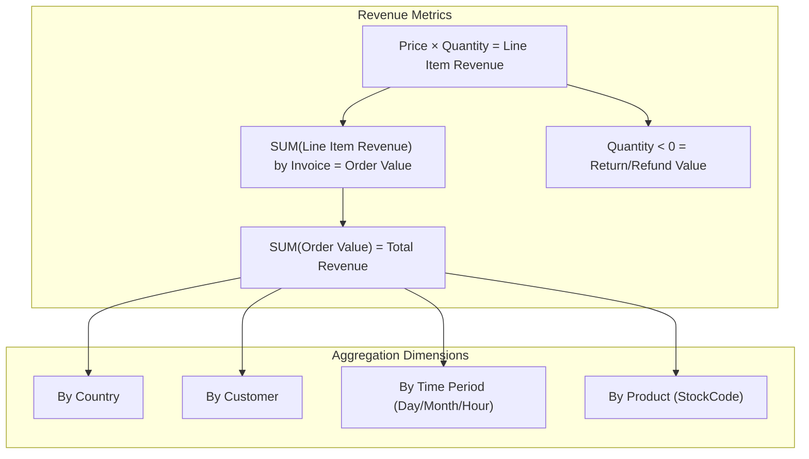
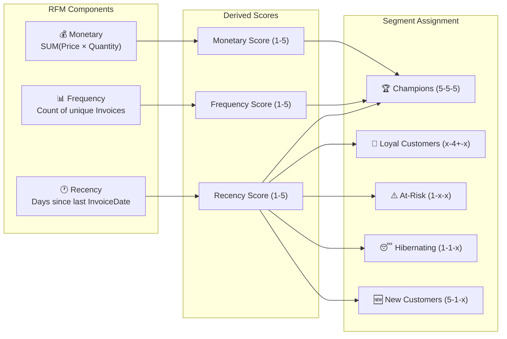

# MarketMind AI — Business Attributes Analysis

## 1. Overview

This document analyzes the business-relevant attributes within the Online Retail Transaction Dataset. Since the dataset is a single flat table of invoice line items, this analysis focuses on identifying which raw attributes drive revenue, customer behavior, and inventory decisions, and how they map to the MarketMind AI modules.

---

## 2. Revenue-Driving Attributes

These attributes directly impact revenue calculation, profitability analysis, and financial reporting.

| Attribute | Type | Business Significance | Analytics Use |
|-----------|------|----------------------|---------------|
| `Price` | Decimal | Base selling price; determines revenue per unit | Pricing analysis, revenue calculation |
| `Quantity` | Integer | Units sold per transaction (negative for returns) | Volume analysis, return rate tracking |
| `Invoice` | String | Groups items into a single transaction/basket | Basket size analysis, order frequency |

### Revenue Analysis Framework

### Key Insights
- **No Cost Data**: The dataset does not include product cost (`unit_cost`), so profit margins cannot be directly calculated without external data or assumed baseline margins.
- **Returns**: Returns are indicated by an `Invoice` starting with 'C' and a negative `Quantity`. These must be netted against gross sales for accurate net revenue.

---

## 3. Customer Behavior Indicators

Attributes that reveal purchasing patterns, customer lifecycle, and engagement levels.

| Attribute | Type | Business Significance | Analytics Use |
|-----------|------|----------------------|---------------|
| `Customer ID` | Numeric | Customer identity linkage | Purchase history tracking, RFM |
| `Country` | String | Customer geographic location | Regional performance, shipping zones |
| `InvoiceDate` | DateTime | Transaction timing | Recency, frequency, seasonal patterns |

### RFM (Recency, Frequency, Monetary) Framework

The dataset supports full RFM analysis for the ~75% of records with a valid `Customer ID`:

---

## 4. Inventory & Product Signals

Attributes critical for product performance, basket analysis, and assumed inventory management.

| Attribute | Type | Business Significance | Analytics Use |
|-----------|------|----------------------|---------------|
| `StockCode` | String | Product identifier | Product sales tracking, recommendations |
| `Description` | String | Product name | Natural language categorization |
| `Quantity` | Integer | Units moved | Demand forecasting |

### Product Categorization Strategy
Since there is no explicit `Category` column, categories must be derived from the `Description` field using NLP or keyword matching (e.g., "BAG", "MUG", "LIGHT", "HEART", "VINTAGE").

### Inventory KPIs (Derived)
| KPI | Formula | Business Value |
|-----|---------|---------------|
| **Total Units Sold** | SUM(Quantity) where Quantity > 0 | Demand volume |
| **Return Rate** | SUM(ABS(Quantity)) for returns / Total Units Sold | Product quality/satisfaction |
| **Average Price** | AVG(Price) per StockCode | Price positioning |

---

## 5. Temporal Attributes

Time-based attributes derived from `InvoiceDate` that enable trend analysis and forecasting.

| Feature | Extraction | Business Significance |
|---------|------------|----------------------|
| `Month/Year` | From InvoiceDate | Monthly revenue trends, year-over-year growth |
| `Day of Week` | From InvoiceDate | Identifying busiest shopping days |
| `Hour of Day` | From InvoiceDate | Optimizing server load, targeted marketing times |

### Expected Seasonal Patterns
The dataset spans a full year, allowing for seasonality detection:
- **Holiday Surge**: High volume expected in Nov–Dec.
- **Time of Day**: E-commerce typically sees peaks during lunch hours and evenings.

---

## 6. Segmentation & ML Feature Mapping

This table maps the derived features to the AI/ML module that consumes them.

| Derived Feature | Source Attribute(s) | ML Module | Role |
|-----------------|---------------------|-----------|------|
| `Recency_Days` | `InvoiceDate`, `Customer ID` | Segmentation, Churn | Behavioral clustering |
| `Order_Frequency`| `Invoice`, `Customer ID` | Segmentation, Churn | Behavioral clustering |
| `Customer_LTV` | `Price`, `Quantity`, `Customer ID` | Segmentation | Value-based grouping |
| `Country` | `Country` | Segmentation | Geographic clustering |
| `Co-purchased_Items`| `StockCode`, `Invoice` | Recommendations | Market Basket Analysis (Apriori) |
| `Daily_Sales_Vol` | `InvoiceDate`, `Quantity` | Forecasting | Time-series prediction |
| `Return_Ratio` | `Quantity` (<0 vs >0) | Anomaly, Quality | Flagging problematic items |

---

## 7. Anomaly Detection Candidates

Patterns where anomalies may indicate fraud, errors, or unusual business events.

| Anomaly Type | Detection Attributes | Severity |
|-------------|---------------------|----------|
| **Unusually large wholesale orders** | `Quantity`, `Price` | High |
| **High return rates** | `Quantity` (negative) | Medium |
| **Zero/Negative Prices** | `Price` | Critical (Data Error/Adjustment) |
| **Non-Product Codes** | `StockCode` (e.g. 'POST', 'M') | Medium (Requires filtering) |
| **Sudden demand spikes** | `Quantity` per `StockCode` over time | Medium |
