# MarketMind AI — Dashboard Layout Plan

## 1. Dashboard Hierarchy

MarketMind AI organizes its dashboards in a five-tier hierarchy, accessible via the left sidebar navigation. Each dashboard serves a specific analytical purpose and maps to defined user roles.

```mermaid
graph TD
    NAV["📊 MarketMind AI"]
    NAV --> D1["🏠 Overview Dashboard"]
    NAV --> D2["💰 Sales Dashboard"]
    NAV --> D3["📦 Inventory Dashboard"]
    NAV --> D4["👥 Customers Dashboard"]
    NAV --> D5["🤖 AI Insights Dashboard"]

    D1 --> W1["KPI Cards + Quick Stats"]
    D1 --> W2["Revenue Trend Chart"]
    D1 --> W3["Alert Feed"]

    D2 --> W4["Sales Analytics"]
    D2 --> W5["Invoice Table"]
    D2 --> W6["Country Breakdown"]

    D3 --> W7["Stock Movements"]
    D3 --> W8["Return Alerts"]
    D3 --> W9["Product Performance"]

    D4 --> W10["Segment Visualization"]
    D4 --> W11["Customer Profiles"]
    D4 --> W12["RFM Analysis"]

    D5 --> W13["Forecast Charts"]
    D5 --> W14["Churn Risk Panel"]
    D5 --> W15["Recommendations"]
    D5 --> W16["Anomaly Alerts"]
```



---

## 2. Layout Grid System

All dashboards use a **12-column responsive grid** system consistent with the Notion design system.

| Breakpoint | Columns | Gutter | Container Max-Width |
|-----------|---------|--------|-------------------|
| Mobile (< 480px) | 4 | 16px | 100% |
| Tablet (768px) | 8 | 20px | 768px |
| Desktop (1024px) | 12 | 24px | 1024px |
| Wide Desktop (≥ 1280px) | 12 | 32px | 1280px |

---

## 3. Dashboard Specifications

### 3.1 Overview Dashboard 🏠

The primary landing page after login. Provides a high-level snapshot of business performance.

```
┌─────────────────────────────────────────────────────────────────┐
│  SIDEBAR  │  🏠 Overview Dashboard            [Date Picker ▾]  │
│           │                                                     │
│  🏠 Overview│  ┌──────────┐ ┌──────────┐ ┌──────────┐ ┌──────────┐ │
│  💰 Sales  │  │ 💰Revenue │ │ 🛒Orders  │ │ 👤Customers│ │ 📉Returns  │ │
│  📦 Inventory│ │ £124,500  │ │  1,210   │ │    420    │ │   3.2%   │ │
│  👥 Customers│ │ ↑12.5%   │ │ ↑8.3%    │ │ ↑15.2%   │ │ ↓0.8%   │ │
│  🤖 AI     │  └──────────┘ └──────────┘ └──────────┘ └──────────┘ │
│  ─────── │                                                     │
│  ⚙️ Settings│  ┌─────────────────────────┐ ┌─────────────────────┐ │
│  👤 Profile│  │  📈 Revenue Trend        │ │  🔔 Active Alerts   │ │
│           │  │  (Line Chart - 12 months)│ │  ┌── Zero Price: 2 │ │
│           │  │                         │ │  ├── High Return: 3 │ │
│           │  │                         │ │  └── Churn Risk: 8  │ │
│           │  └─────────────────────────┘ └─────────────────────┘ │
│           │                                                     │
│           │  ┌─────────────────────────┐ ┌─────────────────────┐ │
│           │  │  🌍 Sales by Country    │ │  🏆 Top 5 Products  │ │
│           │  │  (Map/Bar Chart)        │ │  (Horizontal Bar)   │ │
│           │  └─────────────────────────┘ └─────────────────────┘ │
│           │                                                     │
│           │  ┌───────────────────────────────────────────────────┐ │
│           │  │  📋 Recent Invoices (Table - Last 10)             │ │
│           │  │  Invoice | Date  | Customer | Items | Total | Ctry│ │
│           │  │  ─────── | ───── | ──────── | ───── | ───── | ─── │ │
│           │  └───────────────────────────────────────────────────┘ │
└─────────────────────────────────────────────────────────────────┘
```

#### Widget Specifications

| Widget | Grid Span | Data Source |
|--------|-----------|-------------|
| Revenue KPI | 3 col | SUM(Price × Quantity) where Quantity > 0 |
| Orders KPI | 3 col | COUNT(DISTINCT Invoice) where not starts with 'C' |
| Customers KPI | 3 col | COUNT(DISTINCT Customer ID) |
| Returns KPI | 3 col | ABS(SUM(Quantity < 0)) / SUM(Quantity > 0) |
| Revenue Trend | 8 col | Monthly revenue aggregated |
| Active Alerts | 4 col | anomaly_alerts table |
| Sales by Country | 6 col | SUM revenue grouped by Country |
| Top Products | 6 col | TOP 5 StockCode by revenue |
| Recent Invoices | 12 col | Last 10 distinct invoices |

---

### 3.2 Sales Dashboard 💰

Deep-dive into sales performance with filtering and drill-down capabilities.

```
┌─────────────────────────────────────────────────────────────────┐
│  SIDEBAR  │  💰 Sales Dashboard  [Date Range] [Country ▾]      │
│           │                                                     │
│           │  ┌──────────┐ ┌──────────┐ ┌──────────┐ ┌──────────┐ │
│           │  │ 💰Total   │ │ 📊Avg Val │ │ 📈Growth  │ │ 🛒Items/Ord│
│           │  │ Revenue   │ │  /Order  │ │   Rate   │ │   (Avg)  │ │
│           │  │ £124,500  │ │  £102.89 │ │  +12.5%  │ │   14.2   │ │
│           │  └──────────┘ └──────────┘ └──────────┘ └──────────┘ │
│           │                                                     │
│           │  ┌───────────────────────────────────────────────────┐ │
│           │  │  📈 Daily Sales Trend (Area Chart with Forecast)  │ │
│           │  └───────────────────────────────────────────────────┘ │
│           │                                                     │
│           │  ┌─────────────────────────┐ ┌─────────────────────┐ │
│           │  │  🌍 Revenue by Country  │ │  ⏰ Sales by Hour   │ │
│           │  │  (Grouped Bar Chart)    │ │  (Radar/Bar Chart)  │ │
│           │  └─────────────────────────┘ └─────────────────────┘ │
│           │                                                     │
│           │  ┌───────────────────────────────────────────────────┐ │
│           │  │  📋 All Invoices (Paginated Table)                │ │
│           │  │  [Search] [Filter] [Export CSV] [Export PDF]      │ │
│           │  └───────────────────────────────────────────────────┘ │
└─────────────────────────────────────────────────────────────────┘
```

---

### 3.3 Inventory & Products Dashboard 📦

Since the dataset doesn't have true inventory counts, this focuses on product performance and returns.

```
┌─────────────────────────────────────────────────────────────────┐
│  SIDEBAR  │  📦 Products Dashboard   [Category ▾]              │
│           │                                                     │
│           │  ┌──────────┐ ┌──────────┐ ┌──────────┐ ┌──────────┐ │
│           │  │ 📦Total   │ │ 📈Units   │ │ 📉Return  │ │ 🏷️Avg Price│
│           │  │ Products  │ │  Sold    │ │   Rate   │ │          │ │
│           │  │  3,800    │ │  84,200  │ │   3.2%   │ │   £2.80  │ │
│           │  └──────────┘ └──────────┘ └──────────┘ └──────────┘ │
│           │                                                     │
│           │  ┌───────────────────────────────────────────────────┐ │
│           │  │  🚨 Return Alerts (High Return Rate Products)      │ │
│           │  │  ┌─ 🔴 85123A: 15% return rate (Avg: 3%) ──── ↗ │ │
│           │  │  └─ ⚠️ 71053: 8% return rate ──────────────── ↗ │ │
│           │  └───────────────────────────────────────────────────┘ │
│           │                                                     │
│           │  ┌─────────────────────────┐ ┌─────────────────────┐ │
│           │  │  📊 Top Selling Items   │ │  📉 Highest Returns │ │
│           │  │  (Horizontal Bar)       │ │  (Horizontal Bar)   │ │
│           │  └─────────────────────────┘ └─────────────────────┘ │
│           │                                                     │
│           │  ┌───────────────────────────────────────────────────┐ │
│           │  │  📋 Full Product List (Sortable)                  │ │
│           │  │  Code | Description | Sold | Returned | Avg Price │ │
│           │  └───────────────────────────────────────────────────┘ │
└─────────────────────────────────────────────────────────────────┘
```

---

### 3.4 Customers Dashboard 👥

Customer segmentation, behavior analysis, and RFM scoring.

```
┌─────────────────────────────────────────────────────────────────┐
│  SIDEBAR  │  👥 Customers Dashboard  [Segment ▾] [Country ▾]   │
│           │                                                     │
│           │  ┌──────────┐ ┌──────────┐ ┌──────────┐ ┌──────────┐ │
│           │  │ 👤Known   │ │ 🏆Premium │ │ ⚠️At-Risk │ │ 💰Avg LTV│ │
│           │  │ Customers │ │ Customers│ │ Customers│ │  Value   │ │
│           │  │  4,372    │ │   420    │ │   350    │ │  £1,869  │ │
│           │  └──────────┘ └──────────┘ └──────────┘ └──────────┘ │
│           │                                                     │
│           │  ┌─────────────────────────┐ ┌─────────────────────┐ │
│           │  │  👥 Segment Distribution │ │  📊 RFM Scatter Plot│ │
│           │  │  (Donut Chart)          │ │  (Bubble Chart)     │ │
│           │  └─────────────────────────┘ └─────────────────────┘ │
│           │                                                     │
│           │  ┌───────────────────────────────────────────────────┐ │
│           │  │  📋 Customer Table (Searchable, Segment-filterable)│
│           │  │  ID | Segment | Orders | LTV | Last Active | Ctry │ │
│           │  └───────────────────────────────────────────────────┘ │
└─────────────────────────────────────────────────────────────────┘
```

---

## 4. Role-Based Dashboard Views

Each role sees a filtered version of the dashboards based on the RBAC access matrix.

| Dashboard | Admin/Owner | Store Manager | Sales Executive |
|-----------|:-----------:|:-------------:|:---------------:|
| 🏠 Overview | ✅ Full | ✅ Full | ⚠️ Limited |
| 💰 Sales | ✅ Full | ✅ Full | ⚠️ Own assigned |
| 📦 Products | ✅ Full | ✅ Full | ❌ Hidden |
| 👥 Customers | ✅ Full | ✅ Summary only | ⚠️ Assigned only|
| 🤖 AI Insights | ✅ Full | 👁️ View only | ❌ Hidden |

---

## 5. Chart Color Palette

Using the Notion design system pastel tints for chart series, ensuring accessibility and brand consistency.

| Series | Color Token | Hex | Use |
|--------|------------|-----|-----|
| Series 1 | `primary` | #5645d4 | Primary metric, revenue |
| Series 2 | `brand-teal` | #2a9d99 | Secondary metric, orders |
| Series 3 | `brand-orange` | #dd5b00 | Tertiary, categories/countries |
| Alert High | `semantic-error` | #e03131 | Returns, Cancellations |
| KPI Card 1 | `card-tint-mint` | #d9f3e1 | Revenue card |
| KPI Card 2 | `card-tint-sky` | #dcecfa | Orders card |
| KPI Card 3 | `card-tint-lavender` | #e6e0f5 | Customers card |
| KPI Card 4 | `card-tint-peach` | #ffe8d4 | Returns card |
