# MarketMind AI — Dashboard Layout Plan

## 1. Dashboard Hierarchy

MarketMind AI organizes its dashboards in a five-tier hierarchy, accessible via the left sidebar navigation. Each dashboard serves a specific analytical purpose and maps to defined user roles.

```mermaid
graph TD
    NAV["📊 MarketMind AI"]
    NAV --> D1["🏠 Overview Dashboard"]
    NAV --> D2["💰 Sales Dashboard"]
    NAV --> D3["📦 Inventory Dashboard"]
    NAV --> D4["👥 Customers Dashboard"]
    NAV --> D5["🤖 AI Insights Dashboard"]

    D1 --> W1["KPI Cards + Quick Stats"]
    D1 --> W2["Revenue Trend Chart"]
    D1 --> W3["Alert Feed"]

    D2 --> W4["Sales Analytics"]
    D2 --> W5["Transaction Table"]
    D2 --> W6["Category Breakdown"]

    D3 --> W7["Stock Levels"]
    D3 --> W8["Low-Stock Alerts"]
    D3 --> W9["Warehouse View"]

    D4 --> W10["Segment Visualization"]
    D4 --> W11["Customer Profiles"]
    D4 --> W12["RFM Analysis"]

    D5 --> W13["Forecast Charts"]
    D5 --> W14["Churn Risk Panel"]
    D5 --> W15["Recommendations"]
    D5 --> W16["Anomaly Alerts"]
```



---

## 2. Layout Grid System

All dashboards use a **12-column responsive grid** system consistent with the Notion design system.

| Breakpoint | Columns | Gutter | Container Max-Width |
|-----------|---------|--------|-------------------|
| Mobile (< 480px) | 4 | 16px | 100% |
| Tablet (768px) | 8 | 20px | 768px |
| Desktop (1024px) | 12 | 24px | 1024px |
| Wide Desktop (≥ 1280px) | 12 | 32px | 1280px |

### Widget Size Classes

| Size | Grid Span | Use Case |
|------|-----------|----------|
| **XS** | 3 columns | KPI metric cards |
| **SM** | 4 columns | Small charts, stat panels |
| **MD** | 6 columns | Medium charts, half-width panels |
| **LG** | 8 columns | Large charts, data tables |
| **XL** | 12 columns | Full-width charts, detailed tables |

---

## 3. Dashboard Specifications

### 3.1 Overview Dashboard 🏠

The primary landing page after login. Provides a high-level snapshot of business performance.

```
┌─────────────────────────────────────────────────────────────────┐
│  SIDEBAR  │  🏠 Overview Dashboard            [Date Picker ▾]  │
│           │                                                     │
│  🏠 Overview│  ┌──────────┐ ┌──────────┐ ┌──────────┐ ┌──────────┐ │
│  💰 Sales  │  │ 💰Revenue │ │ 📦Orders  │ │ 👤Customers│ │ 📊AOV    │ │
│  📦 Inventory│ │ $284,500  │ │  5,010   │ │    500    │ │  $56.79  │ │
│  👥 Customers│ │ ↑12.5%   │ │ ↑8.3%    │ │ ↑15.2%   │ │ ↑3.8%   │ │
│  🤖 AI     │  └──────────┘ └──────────┘ └──────────┘ └──────────┘ │
│  🧾 Invoices│                                                     │
│  📋 Reports│  ┌─────────────────────────┐ ┌─────────────────────┐ │
│           │  │  📈 Revenue Trend        │ │  🔔 Active Alerts   │ │
│  ─────── │  │  (Line Chart - 12 months)│ │  ┌── Low Stock: 12 │ │
│  ⚙️ Settings│ │                         │ │  ├── Anomalies: 3  │ │
│  👤 Profile│ │                         │ │  └── Churn Risk: 8  │ │
│           │  └─────────────────────────┘ └─────────────────────┘ │
│           │                                                     │
│           │  ┌─────────────────────────┐ ┌─────────────────────┐ │
│           │  │  🥧 Sales by Category   │ │  🏆 Top 5 Products  │ │
│           │  │  (Donut Chart)          │ │  (Horizontal Bar)   │ │
│           │  │                         │ │                     │ │
│           │  └─────────────────────────┘ └─────────────────────┘ │
│           │                                                     │
│           │  ┌───────────────────────────────────────────────────┐ │
│           │  │  📋 Recent Transactions (Table - Last 10)         │ │
│           │  │  ID  | Date  | Customer | Product | Amount | Pay  │ │
│           │  │  ─── | ───── | ──────── | ─────── | ────── | ─── │ │
│           │  └───────────────────────────────────────────────────┘ │
└─────────────────────────────────────────────────────────────────┘
```

#### Widget Specifications

| Widget | Grid Span | Chart Type | Data Source | Color |
|--------|-----------|-----------|-------------|-------|
| Revenue KPI | 3 col | Metric card | SUM(total_amount) | `card-tint-mint` |
| Orders KPI | 3 col | Metric card | COUNT(transactions) | `card-tint-sky` |
| Customers KPI | 3 col | Metric card | COUNT(customers) | `card-tint-lavender` |
| AOV KPI | 3 col | Metric card | AVG(total_amount) | `card-tint-peach` |
| Revenue Trend | 8 col | Line chart | Monthly revenue | `primary` (#5645d4) |
| Active Alerts | 4 col | Alert list | anomaly_alerts | Semantic colors |
| Sales by Category | 6 col | Donut chart | SUM by category | Pastel palette |
| Top Products | 6 col | Horizontal bar | TOP 5 by revenue | Brand colors |
| Recent Transactions | 12 col | Data table | Last 10 transactions | — |

---

### 3.2 Sales Dashboard 💰

Deep-dive into sales performance with filtering and drill-down capabilities.

```
┌─────────────────────────────────────────────────────────────────┐
│  SIDEBAR  │  💰 Sales Dashboard  [Date Range] [Category ▾] [Store ▾] │
│           │                                                     │
│           │  ┌──────────┐ ┌──────────┐ ┌──────────┐ ┌──────────┐ │
│           │  │ 💰Total   │ │ 📊Avg Txn │ │ 📈Growth  │ │ 🏷️Margin │ │
│           │  │ Revenue   │ │  Value   │ │   Rate   │ │  Average │ │
│           │  │ $284,500  │ │  $56.79  │ │  +12.5%  │ │  42.3%  │ │
│           │  └──────────┘ └──────────┘ └──────────┘ └──────────┘ │
│           │                                                     │
│           │  ┌───────────────────────────────────────────────────┐ │
│           │  │  📈 Daily Sales Trend (Area Chart with Forecast)  │ │
│           │  │  ═══════════════════════════════════════════════  │ │
│           │  │  [Actual ████████████████] [Forecast ░░░░░░░░░]  │ │
│           │  └───────────────────────────────────────────────────┘ │
│           │                                                     │
│           │  ┌─────────────────────────┐ ┌─────────────────────┐ │
│           │  │  📊 Revenue by Store    │ │  💳 Payment Methods  │ │
│           │  │  (Grouped Bar Chart)    │ │  (Pie Chart)        │ │
│           │  └─────────────────────────┘ └─────────────────────┘ │
│           │                                                     │
│           │  ┌─────────────────────────┐ ┌─────────────────────┐ │
│           │  │  📅 Weekly Heatmap      │ │  📊 Category Trend  │ │
│           │  │  (Day × Hour Grid)      │ │  (Stacked Area)     │ │
│           │  └─────────────────────────┘ └─────────────────────┘ │
│           │                                                     │
│           │  ┌───────────────────────────────────────────────────┐ │
│           │  │  📋 All Transactions (Paginated Table)            │ │
│           │  │  [Search] [Filter] [Export CSV] [Export PDF]      │ │
│           │  └───────────────────────────────────────────────────┘ │
└─────────────────────────────────────────────────────────────────┘
```

---

### 3.3 Inventory Dashboard 📦

Stock management with alerts and warehouse tracking.

```
┌─────────────────────────────────────────────────────────────────┐
│  SIDEBAR  │  📦 Inventory Dashboard  [Warehouse ▾] [Category ▾] │
│           │                                                     │
│           │  ┌──────────┐ ┌──────────┐ ┌──────────┐ ┌──────────┐ │
│           │  │ 📦Total   │ │ ⚠️Low     │ │ 🔴Critical│ │ 📊Turnover│
│           │  │ Products  │ │  Stock   │ │  Stock   │ │   Rate   │ │
│           │  │   200     │ │   24     │ │    6     │ │   4.2x   │ │
│           │  └──────────┘ └──────────┘ └──────────┘ └──────────┘ │
│           │                                                     │
│           │  ┌───────────────────────────────────────────────────┐ │
│           │  │  🚨 Stock Alerts (Critical & Low Stock Items)      │ │
│           │  │  ┌─ 🔴 PROD-0023: 2 units (reorder: 10) ──── ↗  │ │
│           │  │  ├─ 🔴 PROD-0089: 0 units (reorder: 5) ───── ↗  │ │
│           │  │  ├─ ⚠️ PROD-0145: 8 units (reorder: 15) ──── ↗  │ │
│           │  │  └─ ⚠️ PROD-0167: 12 units (reorder: 20) ─── ↗  │ │
│           │  └───────────────────────────────────────────────────┘ │
│           │                                                     │
│           │  ┌─────────────────────────┐ ┌─────────────────────┐ │
│           │  │  📊 Stock by Category   │ │  🏭 Warehouse Usage │ │
│           │  │  (Stacked Bar)          │ │  (Treemap)          │ │
│           │  └─────────────────────────┘ └─────────────────────┘ │
│           │                                                     │
│           │  ┌───────────────────────────────────────────────────┐ │
│           │  │  📋 Full Inventory Table (Sortable)               │ │
│           │  │  Product | Stock | Reorder | Status | Supplier    │ │
│           │  └───────────────────────────────────────────────────┘ │
└─────────────────────────────────────────────────────────────────┘
```

---

### 3.4 Customers Dashboard 👥

Customer segmentation, behavior analysis, and RFM scoring.

```
┌─────────────────────────────────────────────────────────────────┐
│  SIDEBAR  │  👥 Customers Dashboard  [Segment ▾] [City ▾]      │
│           │                                                     │
│           │  ┌──────────┐ ┌──────────┐ ┌──────────┐ ┌──────────┐ │
│           │  │ 👤Total   │ │ 🏆Premium │ │ ⚠️At-Risk │ │ 💰Avg LTV│ │
│           │  │ Customers │ │ Customers│ │ Customers│ │  Value   │ │
│           │  │   500     │ │   50     │ │   50     │ │  $569    │ │
│           │  └──────────┘ └──────────┘ └──────────┘ └──────────┘ │
│           │                                                     │
│           │  ┌─────────────────────────┐ ┌─────────────────────┐ │
│           │  │  👥 Segment Distribution │ │  📊 RFM Scatter Plot│ │
│           │  │  (Donut Chart)          │ │  (Bubble Chart)     │ │
│           │  │  ■ Premium   ■ Regular  │ │  X: Recency         │ │
│           │  │  ■ Occasional ■ New     │ │  Y: Frequency       │ │
│           │  │  ■ At-Risk              │ │  Size: Monetary     │ │
│           │  └─────────────────────────┘ └─────────────────────┘ │
│           │                                                     │
│           │  ┌─────────────────────────┐ ┌─────────────────────┐ │
│           │  │  📈 Acquisition Trend   │ │  🌍 City Distribution│ │
│           │  │  (Line - Monthly)       │ │  (Horizontal Bar)   │ │
│           │  └─────────────────────────┘ └─────────────────────┘ │
│           │                                                     │
│           │  ┌───────────────────────────────────────────────────┐ │
│           │  │  📋 Customer Table (Searchable, Segment-filterable)│
│           │  │  Name | Segment | Purchases | LTV | Last Active   │ │
│           │  └───────────────────────────────────────────────────┘ │
└─────────────────────────────────────────────────────────────────┘
```

---

### 3.5 AI Insights Dashboard 🤖

AI/ML model outputs, predictions, and intelligent recommendations.

```
┌─────────────────────────────────────────────────────────────────┐
│  SIDEBAR  │  🤖 AI Insights Dashboard  [Model ▾] [Refresh 🔄]  │
│           │                                                     │
│           │  ┌──── 🔮 Sales Forecast ───────────────────────────┐ │
│           │  │  (Line Chart: Actual vs Predicted + Confidence)  │ │
│           │  │  ───── Actual  ─ ─ ─ Predicted  ░░░ Confidence  │ │
│           │  │  Model: Prophet | MAE: 8.2% | R²: 0.87          │ │
│           │  └───────────────────────────────────────────────────┘ │
│           │                                                     │
│           │  ┌─────────────────────────┐ ┌─────────────────────┐ │
│           │  │  ⚡ Churn Risk Panel    │ │  💡 Top Recommendations│
│           │  │  ┌─ 🔴 High Risk: 12   │ │  ┌─ Customer A:     │ │
│           │  │  ├─ ⚠️ Medium: 28     │ │  │  → Product X, Y  │ │
│           │  │  └─ ✅ Low: 460       │ │  ├─ Customer B:     │ │
│           │  │                         │ │  │  → Product Z     │ │
│           │  │  [View All At-Risk →]   │ │  └─ [View All →]   │ │
│           │  └─────────────────────────┘ └─────────────────────┘ │
│           │                                                     │
│           │  ┌─────────────────────────┐ ┌─────────────────────┐ │
│           │  │  🚨 Anomaly Detections  │ │  📊 Model Performance│ │
│           │  │  (Timeline Feed)        │ │  (Radar Chart)      │ │
│           │  │  ┌── Unusual spike...   │ │  MAE | RMSE | R²    │ │
│           │  │  ├── Stock anomaly...   │ │  Precision | Recall │ │
│           │  │  └── Revenue outlier... │ │                     │ │
│           │  └─────────────────────────┘ └─────────────────────┘ │
└─────────────────────────────────────────────────────────────────┘
```

---

## 4. Role-Based Dashboard Views

Each role sees a filtered version of the dashboards based on the RBAC access matrix.

| Dashboard | Business Owner | Store Manager | Sales Executive | Admin |
|-----------|:--------------:|:-------------:|:---------------:|:-----:|
| 🏠 Overview | ✅ Full | ✅ Full | ⚠️ Sales only | ✅ Full |
| 💰 Sales | ✅ Full | ✅ Full | ⚠️ Own records | ✅ Full |
| 📦 Inventory | 👁️ View only | ✅ Full + Edit | ❌ Hidden | ✅ Full |
| 👥 Customers | ✅ Full | ✅ Summary only | ⚠️ Assigned only | ✅ Full |
| 🤖 AI Insights | ✅ Full | 👁️ View only | ❌ Hidden | ✅ Full + Config |
| 🧾 Invoices | 👁️ View only | 👁️ View only | ✅ Full CRUD | ✅ Full |

---

## 5. Interaction Patterns

### 5.1 Global Filters (Persistent Across Dashboards)
- **Date Range Picker**: Preset options (Today, 7 Days, 30 Days, Quarter, Year, Custom)
- **Store Location**: Multi-select dropdown
- **Category**: Multi-select dropdown

### 5.2 Widget Interactions
- **Hover**: Tooltip with exact values and percentage context
- **Click on chart segment**: Drill-down to filtered view
- **Click on table row**: Navigate to detail page
- **Export button**: Download as CSV or PDF
- **Refresh button**: Reload data (auto-refresh every 5 minutes)

### 5.3 Navigation Pattern
```
Sidebar (permanent) → Dashboard Page → Widget → Detail View → Back
```

---

## 6. Chart Color Palette

Using the Notion design system pastel tints for chart series, ensuring accessibility and brand consistency.

| Series | Color Token | Hex | Use |
|--------|------------|-----|-----|
| Series 1 | `primary` | #5645d4 | Primary metric, revenue |
| Series 2 | `brand-teal` | #2a9d99 | Secondary metric, orders |
| Series 3 | `brand-orange` | #dd5b00 | Tertiary, categories |
| Series 4 | `brand-pink` | #ff64c8 | Accent, segments |
| Series 5 | `brand-green` | #1aae39 | Positive indicators |
| KPI Card 1 | `card-tint-mint` | #d9f3e1 | Revenue card |
| KPI Card 2 | `card-tint-sky` | #dcecfa | Orders card |
| KPI Card 3 | `card-tint-lavender` | #e6e0f5 | Customers card |
| KPI Card 4 | `card-tint-peach` | #ffe8d4 | AOV card |
| Alert High | `semantic-error` | #e03131 | Critical alerts |
| Alert Medium | `semantic-warning` | #dd5b00 | Warning alerts |
| Alert Low | `semantic-success` | #1aae39 | Info/success |

---

## 7. Responsive Behavior

| Component | Desktop (≥1280px) | Tablet (768px) | Mobile (<480px) |
|-----------|-------------------|----------------|-----------------|
| Sidebar | Expanded (240px) | Collapsed (icons) | Hidden (hamburger) |
| KPI Cards | 4 across | 2 across | 1 column stacked |
| Charts | 2 per row | 1 per row | 1 per row (full width) |
| Data Tables | Full columns | Scroll horizontal | Card view |
| Filters | Inline bar | Collapsible panel | Bottom sheet |
