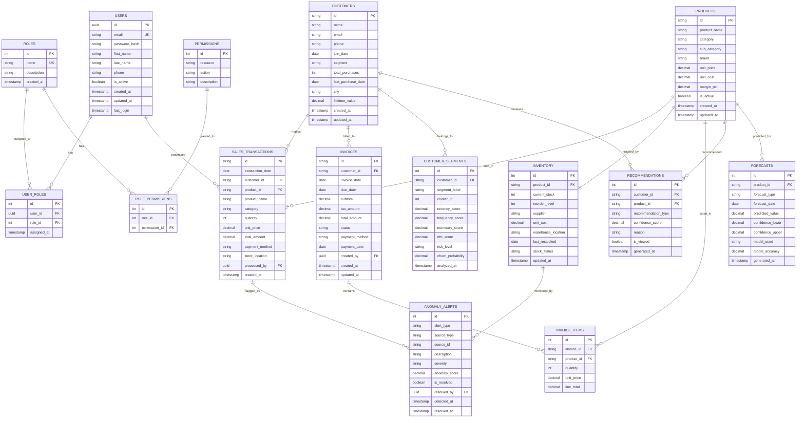
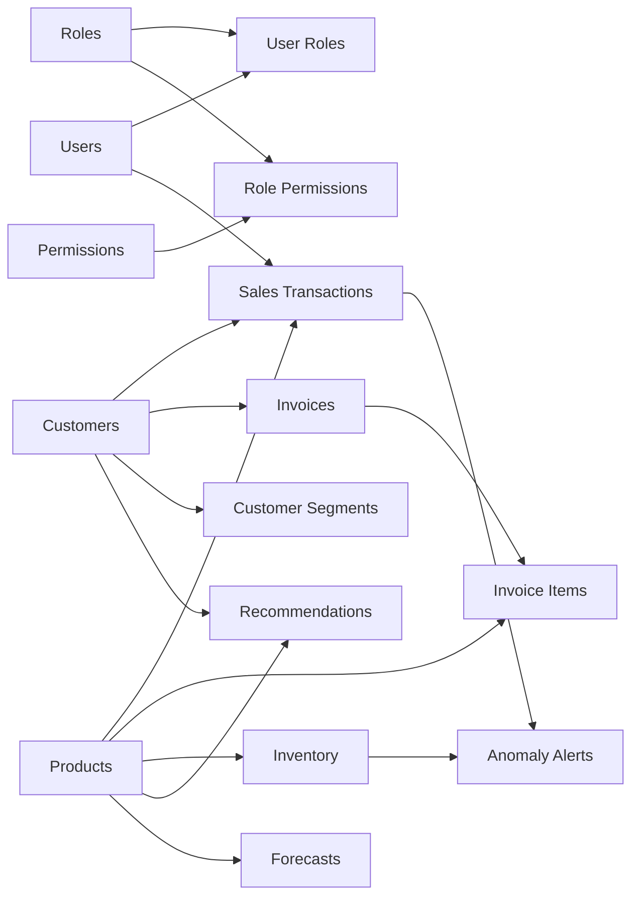

# MarketMind AI — Database Design

## 1. Entity-Relationship Diagram



---

## 2. Table Definitions (DDL)

### 2.1 Users & Access Control

```sql
-- ═══════════════════════════════════════════════════════════════
-- Users Table
-- ═══════════════════════════════════════════════════════════════
CREATE TABLE users (
    id              UUID PRIMARY KEY DEFAULT gen_random_uuid(),
    email           VARCHAR(255) NOT NULL UNIQUE,
    password_hash   VARCHAR(255) NOT NULL,
    first_name      VARCHAR(100) NOT NULL,
    last_name       VARCHAR(100) NOT NULL,
    phone           VARCHAR(20),
    is_active       BOOLEAN DEFAULT TRUE,
    created_at      TIMESTAMP DEFAULT CURRENT_TIMESTAMP,
    updated_at      TIMESTAMP DEFAULT CURRENT_TIMESTAMP,
    last_login      TIMESTAMP
);

CREATE INDEX idx_users_email ON users(email);
CREATE INDEX idx_users_active ON users(is_active);

-- ═══════════════════════════════════════════════════════════════
-- Roles Table
-- ═══════════════════════════════════════════════════════════════
CREATE TABLE roles (
    id              SERIAL PRIMARY KEY,
    name            VARCHAR(50) NOT NULL UNIQUE,
    description     TEXT,
    created_at      TIMESTAMP DEFAULT CURRENT_TIMESTAMP
);

-- Seed default roles
INSERT INTO roles (name, description) VALUES
    ('business_owner', 'Business Owner - Full analytics access, no AI config'),
    ('store_manager', 'Store Manager - Inventory and sales management'),
    ('sales_executive', 'Sales Executive - Transaction and invoice processing'),
    ('admin', 'System Administrator - Full platform access');

-- ═══════════════════════════════════════════════════════════════
-- User-Roles Junction Table
-- ═══════════════════════════════════════════════════════════════
CREATE TABLE user_roles (
    id              SERIAL PRIMARY KEY,
    user_id         UUID NOT NULL REFERENCES users(id) ON DELETE CASCADE,
    role_id         INTEGER NOT NULL REFERENCES roles(id) ON DELETE CASCADE,
    assigned_at     TIMESTAMP DEFAULT CURRENT_TIMESTAMP,
    UNIQUE(user_id, role_id)
);

CREATE INDEX idx_user_roles_user ON user_roles(user_id);

-- ═══════════════════════════════════════════════════════════════
-- Permissions Table
-- ═══════════════════════════════════════════════════════════════
CREATE TABLE permissions (
    id              SERIAL PRIMARY KEY,
    resource        VARCHAR(100) NOT NULL,  -- e.g., 'sales_dashboard', 'inventory', 'forecast_reports'
    action          VARCHAR(50) NOT NULL,   -- e.g., 'view', 'create', 'update', 'delete', 'export'
    description     TEXT,
    UNIQUE(resource, action)
);

-- Seed permissions
INSERT INTO permissions (resource, action, description) VALUES
    ('sales_dashboard', 'view', 'View sales dashboard and KPIs'),
    ('sales_dashboard', 'export', 'Export sales reports'),
    ('inventory', 'view', 'View inventory levels'),
    ('inventory', 'manage', 'Add, update, and manage inventory records'),
    ('forecast_reports', 'view', 'View AI forecasting reports'),
    ('churn_reports', 'view', 'View churn prediction reports'),
    ('recommendations', 'view', 'View product recommendation insights'),
    ('customer_segments', 'view', 'View customer segmentation reports'),
    ('invoices', 'view', 'View invoices'),
    ('invoices', 'manage', 'Create and manage invoices'),
    ('users', 'manage', 'Manage user accounts and roles'),
    ('ai_config', 'manage', 'Configure AI model parameters'),
    ('datasets', 'manage', 'Upload and manage datasets'),
    ('system', 'monitor', 'Monitor system activity and logs');

-- ═══════════════════════════════════════════════════════════════
-- Role-Permissions Junction Table
-- ═══════════════════════════════════════════════════════════════
CREATE TABLE role_permissions (
    id              SERIAL PRIMARY KEY,
    role_id         INTEGER NOT NULL REFERENCES roles(id) ON DELETE CASCADE,
    permission_id   INTEGER NOT NULL REFERENCES permissions(id) ON DELETE CASCADE,
    UNIQUE(role_id, permission_id)
);

-- Business Owner permissions
INSERT INTO role_permissions (role_id, permission_id)
SELECT r.id, p.id FROM roles r, permissions p
WHERE r.name = 'business_owner'
  AND (p.resource, p.action) IN (
    ('sales_dashboard', 'view'), ('sales_dashboard', 'export'),
    ('inventory', 'view'), ('forecast_reports', 'view'),
    ('churn_reports', 'view'), ('recommendations', 'view'),
    ('customer_segments', 'view'), ('invoices', 'view')
  );

-- Store Manager permissions
INSERT INTO role_permissions (role_id, permission_id)
SELECT r.id, p.id FROM roles r, permissions p
WHERE r.name = 'store_manager'
  AND (p.resource, p.action) IN (
    ('sales_dashboard', 'view'), ('inventory', 'view'),
    ('inventory', 'manage'), ('recommendations', 'view'),
    ('customer_segments', 'view'), ('forecast_reports', 'view'),
    ('churn_reports', 'view')
  );

-- Sales Executive permissions
INSERT INTO role_permissions (role_id, permission_id)
SELECT r.id, p.id FROM roles r, permissions p
WHERE r.name = 'sales_executive'
  AND (p.resource, p.action) IN (
    ('sales_dashboard', 'view'), ('invoices', 'view'),
    ('invoices', 'manage'), ('recommendations', 'view')
  );

-- Admin permissions (all)
INSERT INTO role_permissions (role_id, permission_id)
SELECT r.id, p.id FROM roles r, permissions p
WHERE r.name = 'admin';
```

### 2.2 Core Business Tables

```sql
-- ═══════════════════════════════════════════════════════════════
-- Products Table
-- ═══════════════════════════════════════════════════════════════
CREATE TABLE products (
    id              VARCHAR(20) PRIMARY KEY,  -- e.g., PROD-0001
    product_name    VARCHAR(200) NOT NULL,
    category        VARCHAR(100) NOT NULL,
    sub_category    VARCHAR(100),
    brand           VARCHAR(100),
    unit_price      DECIMAL(10, 2) NOT NULL,
    unit_cost       DECIMAL(10, 2) NOT NULL,
    margin_pct      DECIMAL(5, 1),
    is_active       BOOLEAN DEFAULT TRUE,
    created_at      TIMESTAMP DEFAULT CURRENT_TIMESTAMP,
    updated_at      TIMESTAMP DEFAULT CURRENT_TIMESTAMP
);

CREATE INDEX idx_products_category ON products(category);
CREATE INDEX idx_products_brand ON products(brand);
CREATE INDEX idx_products_active ON products(is_active);

-- ═══════════════════════════════════════════════════════════════
-- Customers Table
-- ═══════════════════════════════════════════════════════════════
CREATE TABLE customers (
    id              VARCHAR(20) PRIMARY KEY,  -- e.g., CUST-0001
    name            VARCHAR(200) NOT NULL,
    email           VARCHAR(255) UNIQUE,
    phone           VARCHAR(20),
    join_date       DATE NOT NULL,
    segment         VARCHAR(50),
    total_purchases INTEGER DEFAULT 0,
    last_purchase_date DATE,
    city            VARCHAR(100),
    lifetime_value  DECIMAL(12, 2) DEFAULT 0,
    created_at      TIMESTAMP DEFAULT CURRENT_TIMESTAMP,
    updated_at      TIMESTAMP DEFAULT CURRENT_TIMESTAMP
);

CREATE INDEX idx_customers_segment ON customers(segment);
CREATE INDEX idx_customers_city ON customers(city);
CREATE INDEX idx_customers_last_purchase ON customers(last_purchase_date);

-- ═══════════════════════════════════════════════════════════════
-- Sales Transactions Table
-- ═══════════════════════════════════════════════════════════════
CREATE TABLE sales_transactions (
    id              VARCHAR(20) PRIMARY KEY,  -- e.g., TXN-000001
    transaction_date DATE NOT NULL,
    customer_id     VARCHAR(20) REFERENCES customers(id),
    product_id      VARCHAR(20) NOT NULL REFERENCES products(id),
    product_name    VARCHAR(200),
    category        VARCHAR(100),
    quantity        INTEGER NOT NULL CHECK (quantity > 0),
    unit_price      DECIMAL(10, 2) NOT NULL CHECK (unit_price >= 0),
    total_amount    DECIMAL(12, 2) NOT NULL,
    payment_method  VARCHAR(50),
    store_location  VARCHAR(100),
    processed_by    UUID REFERENCES users(id),
    created_at      TIMESTAMP DEFAULT CURRENT_TIMESTAMP
);

CREATE INDEX idx_txn_date ON sales_transactions(transaction_date);
CREATE INDEX idx_txn_customer ON sales_transactions(customer_id);
CREATE INDEX idx_txn_product ON sales_transactions(product_id);
CREATE INDEX idx_txn_category ON sales_transactions(category);
CREATE INDEX idx_txn_store ON sales_transactions(store_location);
CREATE INDEX idx_txn_payment ON sales_transactions(payment_method);

-- ═══════════════════════════════════════════════════════════════
-- Inventory Table
-- ═══════════════════════════════════════════════════════════════
CREATE TABLE inventory (
    id              SERIAL PRIMARY KEY,
    product_id      VARCHAR(20) NOT NULL UNIQUE REFERENCES products(id),
    current_stock   INTEGER NOT NULL DEFAULT 0,
    reorder_level   INTEGER NOT NULL DEFAULT 10,
    supplier        VARCHAR(200),
    unit_cost       DECIMAL(10, 2),
    warehouse_location VARCHAR(100),
    last_restocked  DATE,
    stock_status    VARCHAR(20) DEFAULT 'OK',  -- OK, Low, Critical, Out_of_Stock
    updated_at      TIMESTAMP DEFAULT CURRENT_TIMESTAMP
);

CREATE INDEX idx_inv_product ON inventory(product_id);
CREATE INDEX idx_inv_status ON inventory(stock_status);
CREATE INDEX idx_inv_warehouse ON inventory(warehouse_location);

-- ═══════════════════════════════════════════════════════════════
-- Invoices Table
-- ═══════════════════════════════════════════════════════════════
CREATE TABLE invoices (
    id              VARCHAR(20) PRIMARY KEY,  -- e.g., INV-000001
    customer_id     VARCHAR(20) NOT NULL REFERENCES customers(id),
    invoice_date    DATE NOT NULL,
    due_date        DATE NOT NULL,
    subtotal        DECIMAL(12, 2) NOT NULL,
    tax_amount      DECIMAL(10, 2) DEFAULT 0,
    total_amount    DECIMAL(12, 2) NOT NULL,
    status          VARCHAR(20) DEFAULT 'Pending',  -- Pending, Paid, Overdue, Cancelled
    payment_method  VARCHAR(50),
    payment_date    DATE,
    created_by      UUID REFERENCES users(id),
    created_at      TIMESTAMP DEFAULT CURRENT_TIMESTAMP,
    updated_at      TIMESTAMP DEFAULT CURRENT_TIMESTAMP
);

CREATE INDEX idx_inv_customer ON invoices(customer_id);
CREATE INDEX idx_inv_status ON invoices(status);
CREATE INDEX idx_inv_date ON invoices(invoice_date);

-- ═══════════════════════════════════════════════════════════════
-- Invoice Items Table
-- ═══════════════════════════════════════════════════════════════
CREATE TABLE invoice_items (
    id              SERIAL PRIMARY KEY,
    invoice_id      VARCHAR(20) NOT NULL REFERENCES invoices(id) ON DELETE CASCADE,
    product_id      VARCHAR(20) NOT NULL REFERENCES products(id),
    quantity        INTEGER NOT NULL CHECK (quantity > 0),
    unit_price      DECIMAL(10, 2) NOT NULL,
    line_total      DECIMAL(12, 2) NOT NULL
);

CREATE INDEX idx_inv_items_invoice ON invoice_items(invoice_id);
```

### 2.3 AI/ML Tables

```sql
-- ═══════════════════════════════════════════════════════════════
-- Forecasts Table
-- ═══════════════════════════════════════════════════════════════
CREATE TABLE forecasts (
    id              SERIAL PRIMARY KEY,
    product_id      VARCHAR(20) REFERENCES products(id),
    forecast_type   VARCHAR(50) NOT NULL,  -- 'revenue', 'demand', 'seasonal'
    forecast_date   DATE NOT NULL,
    predicted_value DECIMAL(12, 2) NOT NULL,
    confidence_lower DECIMAL(12, 2),
    confidence_upper DECIMAL(12, 2),
    model_used      VARCHAR(50),           -- 'prophet', 'xgboost', 'random_forest'
    model_accuracy  DECIMAL(5, 4),         -- R² or similar metric
    generated_at    TIMESTAMP DEFAULT CURRENT_TIMESTAMP
);

CREATE INDEX idx_forecast_type ON forecasts(forecast_type);
CREATE INDEX idx_forecast_date ON forecasts(forecast_date);
CREATE INDEX idx_forecast_product ON forecasts(product_id);

-- ═══════════════════════════════════════════════════════════════
-- Customer Segments Table
-- ═══════════════════════════════════════════════════════════════
CREATE TABLE customer_segments (
    id              SERIAL PRIMARY KEY,
    customer_id     VARCHAR(20) NOT NULL REFERENCES customers(id),
    segment_label   VARCHAR(50) NOT NULL,  -- 'Premium', 'Regular', 'At-Risk', etc.
    cluster_id      INTEGER,
    recency_score   DECIMAL(5, 2),
    frequency_score DECIMAL(5, 2),
    monetary_score  DECIMAL(5, 2),
    rfm_score       DECIMAL(5, 2),
    risk_level      VARCHAR(20),           -- 'Low', 'Medium', 'High'
    churn_probability DECIMAL(5, 4),
    analyzed_at     TIMESTAMP DEFAULT CURRENT_TIMESTAMP
);

CREATE INDEX idx_segment_customer ON customer_segments(customer_id);
CREATE INDEX idx_segment_label ON customer_segments(segment_label);
CREATE INDEX idx_segment_risk ON customer_segments(risk_level);

-- ═══════════════════════════════════════════════════════════════
-- Anomaly Alerts Table
-- ═══════════════════════════════════════════════════════════════
CREATE TABLE anomaly_alerts (
    id              SERIAL PRIMARY KEY,
    alert_type      VARCHAR(50) NOT NULL,  -- 'sales_anomaly', 'inventory_anomaly', 'fraud'
    source_type     VARCHAR(50) NOT NULL,  -- 'transaction', 'inventory', 'revenue'
    source_id       VARCHAR(20),           -- Reference to the source record
    description     TEXT NOT NULL,
    severity        VARCHAR(20) NOT NULL,  -- 'Low', 'Medium', 'High', 'Critical'
    anomaly_score   DECIMAL(5, 4),
    is_resolved     BOOLEAN DEFAULT FALSE,
    resolved_by     UUID REFERENCES users(id),
    detected_at     TIMESTAMP DEFAULT CURRENT_TIMESTAMP,
    resolved_at     TIMESTAMP
);

CREATE INDEX idx_anomaly_type ON anomaly_alerts(alert_type);
CREATE INDEX idx_anomaly_severity ON anomaly_alerts(severity);
CREATE INDEX idx_anomaly_resolved ON anomaly_alerts(is_resolved);

-- ═══════════════════════════════════════════════════════════════
-- Recommendations Table
-- ═══════════════════════════════════════════════════════════════
CREATE TABLE recommendations (
    id              SERIAL PRIMARY KEY,
    customer_id     VARCHAR(20) NOT NULL REFERENCES customers(id),
    product_id      VARCHAR(20) NOT NULL REFERENCES products(id),
    recommendation_type VARCHAR(50) NOT NULL,  -- 'cross_sell', 'upsell', 'personalized'
    confidence_score DECIMAL(5, 4),
    reason          TEXT,
    is_viewed       BOOLEAN DEFAULT FALSE,
    generated_at    TIMESTAMP DEFAULT CURRENT_TIMESTAMP
);

CREATE INDEX idx_rec_customer ON recommendations(customer_id);
CREATE INDEX idx_rec_type ON recommendations(recommendation_type);
```

---

## 3. Indexing Strategy

| Table | Index | Columns | Purpose |
|-------|-------|---------|---------|
| `users` | `idx_users_email` | email | Login lookups |
| `sales_transactions` | `idx_txn_date` | transaction_date | Date range queries |
| `sales_transactions` | `idx_txn_customer` | customer_id | Customer history |
| `sales_transactions` | `idx_txn_category` | category | Category analytics |
| `products` | `idx_products_category` | category | Category filtering |
| `inventory` | `idx_inv_status` | stock_status | Low-stock alerts |
| `customer_segments` | `idx_segment_risk` | risk_level | Churn risk queries |
| `anomaly_alerts` | `idx_anomaly_severity` | severity | Alert prioritization |
| `forecasts` | `idx_forecast_date` | forecast_date | Time-based forecast retrieval |

---

## 4. Data Relationships Summary



---

## 5. Migration Strategy

- **Development**: Use SQLite with SQLAlchemy ORM for rapid iteration
- **Staging/Production**: PostgreSQL with Alembic migrations
- **Schema migrations**: Version-controlled via Alembic, auto-generated from SQLAlchemy models
- **Data seeding**: Default roles, permissions, and sample data via migration scripts
