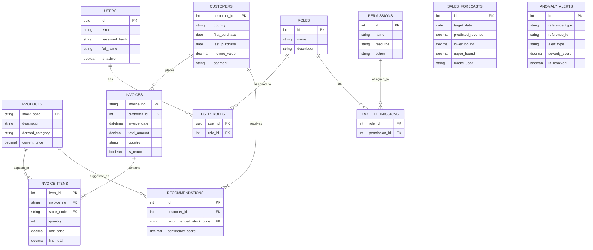

# MarketMind AI — Database Design

## 1. Overview

MarketMind AI's database is designed to ingest the flat UCI Online Retail Dataset (`Invoice`, `StockCode`, `Description`, `Quantity`, `InvoiceDate`, `Price`, `Customer ID`, `Country`) and normalize it into a structured relational format. The design supports Role-Based Access Control (RBAC), normalized business entities, and specialized tables for AI/ML outputs.

---

## 2. Entity Relationship Diagram



---

## 3. Data Definition Language (DDL)

### 3.1 Core Business Entities (Derived from UCI Dataset)

```sql
-- Customers (Derived from Customer ID & Country)
CREATE TABLE customers (
    customer_id INTEGER PRIMARY KEY, -- Maps directly to UCI Customer ID
    country VARCHAR(100) NOT NULL,
    first_purchase DATE,
    last_purchase DATE,
    lifetime_value DECIMAL(12,2) DEFAULT 0,
    segment VARCHAR(50),
    created_at TIMESTAMP DEFAULT CURRENT_TIMESTAMP,
    updated_at TIMESTAMP DEFAULT CURRENT_TIMESTAMP
);

-- Products (Derived from StockCode & Description)
CREATE TABLE products (
    stock_code VARCHAR(50) PRIMARY KEY, -- Maps directly to UCI StockCode
    description VARCHAR(255),
    derived_category VARCHAR(100), -- NLP derived category
    current_price DECIMAL(10,2), -- Latest known price
    created_at TIMESTAMP DEFAULT CURRENT_TIMESTAMP,
    updated_at TIMESTAMP DEFAULT CURRENT_TIMESTAMP
);

-- Invoices (Derived from Invoice, InvoiceDate, Customer ID)
CREATE TABLE invoices (
    invoice_no VARCHAR(50) PRIMARY KEY, -- Maps directly to UCI Invoice
    customer_id INTEGER, -- Nullable for guest checkouts
    invoice_date TIMESTAMP NOT NULL,
    total_amount DECIMAL(12,2) NOT NULL,
    country VARCHAR(100),
    is_return BOOLEAN DEFAULT FALSE, -- True if starts with 'C'
    created_at TIMESTAMP DEFAULT CURRENT_TIMESTAMP,
    FOREIGN KEY (customer_id) REFERENCES customers(customer_id)
);

-- Invoice Items (Derived from individual UCI rows)
CREATE TABLE invoice_items (
    item_id SERIAL PRIMARY KEY,
    invoice_no VARCHAR(50) NOT NULL,
    stock_code VARCHAR(50) NOT NULL,
    quantity INTEGER NOT NULL,
    unit_price DECIMAL(10,2) NOT NULL,
    line_total DECIMAL(10,2) NOT NULL, -- Quantity * Price
    FOREIGN KEY (invoice_no) REFERENCES invoices(invoice_no),
    FOREIGN KEY (stock_code) REFERENCES products(stock_code)
);
```

### 3.2 System & Authentication (RBAC)

```sql
CREATE TABLE users (
    id UUID PRIMARY KEY DEFAULT uuid_generate_v4(),
    email VARCHAR(255) UNIQUE NOT NULL,
    password_hash VARCHAR(255) NOT NULL,
    full_name VARCHAR(100) NOT NULL,
    is_active BOOLEAN DEFAULT TRUE,
    last_login TIMESTAMP,
    created_at TIMESTAMP DEFAULT CURRENT_TIMESTAMP
);

CREATE TABLE roles (
    id SERIAL PRIMARY KEY,
    name VARCHAR(50) UNIQUE NOT NULL,
    description VARCHAR(255)
);

CREATE TABLE user_roles (
    user_id UUID REFERENCES users(id) ON DELETE CASCADE,
    role_id INTEGER REFERENCES roles(id) ON DELETE CASCADE,
    PRIMARY KEY (user_id, role_id)
);

CREATE TABLE permissions (
    id SERIAL PRIMARY KEY,
    name VARCHAR(100) UNIQUE NOT NULL,
    resource VARCHAR(50) NOT NULL,
    action VARCHAR(50) NOT NULL
);

CREATE TABLE role_permissions (
    role_id INTEGER REFERENCES roles(id) ON DELETE CASCADE,
    permission_id INTEGER REFERENCES permissions(id) ON DELETE CASCADE,
    PRIMARY KEY (role_id, permission_id)
);
```

### 3.3 AI & Analytics Output Tables

```sql
CREATE TABLE sales_forecasts (
    id SERIAL PRIMARY KEY,
    target_date DATE NOT NULL,
    predicted_revenue DECIMAL(12,2) NOT NULL,
    lower_bound DECIMAL(12,2),
    upper_bound DECIMAL(12,2),
    model_used VARCHAR(100),
    created_at TIMESTAMP DEFAULT CURRENT_TIMESTAMP
);

CREATE TABLE anomaly_alerts (
    id SERIAL PRIMARY KEY,
    reference_type VARCHAR(50) NOT NULL, -- e.g., 'INVOICE', 'PRODUCT'
    reference_id VARCHAR(50) NOT NULL,   -- e.g., '536365'
    alert_type VARCHAR(100) NOT NULL,    -- e.g., 'PRICE_ZERO', 'HIGH_RETURN'
    severity_score DECIMAL(5,2),
    is_resolved BOOLEAN DEFAULT FALSE,
    created_at TIMESTAMP DEFAULT CURRENT_TIMESTAMP
);

CREATE TABLE recommendations (
    id SERIAL PRIMARY KEY,
    customer_id INTEGER NOT NULL,
    recommended_stock_code VARCHAR(50) NOT NULL,
    confidence_score DECIMAL(5,2) NOT NULL,
    created_at TIMESTAMP DEFAULT CURRENT_TIMESTAMP,
    FOREIGN KEY (customer_id) REFERENCES customers(customer_id),
    FOREIGN KEY (recommended_stock_code) REFERENCES products(stock_code)
);
```

---

## 4. Indexing Strategy

To support the heavy analytical queries required by the MarketMind dashboards, the following indexes are essential:

```sql
-- Foreign Key Indexes
CREATE INDEX idx_invoices_customer ON invoices(customer_id);
CREATE INDEX idx_invoice_items_invoice ON invoice_items(invoice_no);
CREATE INDEX idx_invoice_items_product ON invoice_items(stock_code);

-- Time-Series Analytics Indexes
CREATE INDEX idx_invoices_date ON invoices(invoice_date);

-- Search Indexes
CREATE INDEX idx_products_description ON products(description);
CREATE INDEX idx_customers_country ON customers(country);

-- Composite Indexes for aggregations
CREATE INDEX idx_items_invoice_stock ON invoice_items(invoice_no, stock_code);
```

---

## 5. Seed Data (Roles & Permissions)

```sql
INSERT INTO roles (name, description) VALUES
('ADMIN', 'Full system access'),
('OWNER', 'Business owner, full dashboard access'),
('MANAGER', 'Store manager, inventory management'),
('SALES', 'Sales executive, limited viewing');

INSERT INTO permissions (name, resource, action) VALUES
('view_dashboard', 'dashboard', 'read'),
('view_sales', 'sales', 'read'),
('manage_inventory', 'inventory', 'write'),
('view_customers', 'customers', 'read'),
('manage_users', 'users', 'write'),
('view_ai', 'ai_insights', 'read');

-- Assign all permissions to ADMIN
INSERT INTO role_permissions (role_id, permission_id)
SELECT r.id, p.id FROM roles r, permissions p WHERE r.name = 'ADMIN';
```

---

## 6. Migration Strategy

1. **Phase 1: Local Development (SQLite)**
   - Use SQLite for rapid prototyping and local testing.
   - Ignore UUIDs (use integers) and standard timestamp functions.

2. **Phase 2: Production (PostgreSQL)**
   - Run the full DDL provided above.
   - Use PostgreSQL's `uuid-ossp` extension for secure user IDs.
   - Utilize PostgreSQL's advanced JSONB columns if raw log data needs to be stored.
