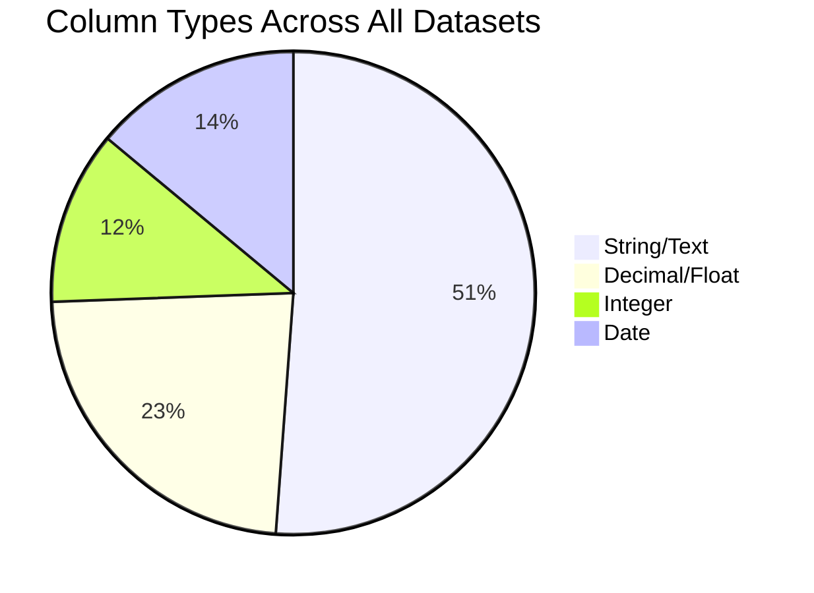
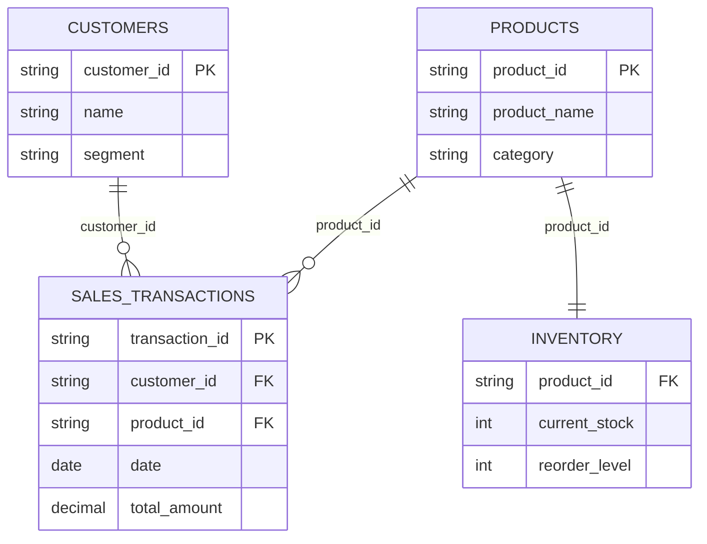

# MarketMind AI — Dataset Structure Analysis

## 1. Dataset Overview

MarketMind AI uses four interrelated datasets that model a retail business environment. All datasets are synthetic but designed with realistic distributions, seasonal patterns, and intentional data quality issues for preprocessing exercises.

| Dataset | File | Records | Columns | Size (est.) |
|---------|------|---------|---------|-------------|
| Sales Transactions | `sales_transactions.csv` | ~5,010 | 11 | ~500 KB |
| Products | `products.csv` | 200 | 8 | ~20 KB |
| Customers | `customers.csv` | 500 | 9 | ~40 KB |
| Inventory | `inventory.csv` | 200 | 9 | ~18 KB |

---

## 2. Schema Details

### 2.1 Sales Transactions (`sales_transactions.csv`)

| Column | Data Type | Nullable | Description | Example |
|--------|-----------|----------|-------------|---------|
| `transaction_id` | String (ID) | No | Unique transaction identifier | TXN-000001 |
| `date` | Date (YYYY-MM-DD) | ~1% missing | Transaction date | 2025-03-15 |
| `customer_id` | String (FK) | ~1% missing | Reference to customers table | CUST-0042 |
| `product_id` | String (FK) | No | Reference to products table | PROD-0103 |
| `product_name` | String | No | Denormalized product name | TechPro Galaxy Pro X |
| `category` | String | No | Product category | Electronics |
| `quantity` | Integer | No | Units purchased (may be negative in dirty data) | 3 |
| `unit_price` | Decimal | No | Price per unit (may include discounts) | 29.99 |
| `total_amount` | Decimal | No | quantity × unit_price | 89.97 |
| `payment_method` | String | No | Payment type | Credit Card |
| `store_location` | String | No | Store branch name | Downtown Store |

**Key Observations:**
- Date range: January 1, 2025 — December 31, 2025 (12 months)
- ~2% of records contain intentional data quality issues (missing customer_id, missing date, negative quantities, extra whitespace)
- ~10 duplicate records included for preprocessing detection
- Seasonal patterns: higher transaction volume in Nov-Dec (holiday season), lower in Jan-Feb
- Day-of-week patterns: higher sales on Fri-Sat, lower on Mon-Tue

### 2.2 Products (`products.csv`)

| Column | Data Type | Nullable | Description | Example |
|--------|-----------|----------|-------------|---------|
| `product_id` | String (PK) | No | Unique product identifier | PROD-0001 |
| `product_name` | String | No | Full product name with brand | TechPro Galaxy Pro X |
| `category` | String | No | Top-level category | Electronics |
| `sub_category` | String | No | Sub-category | Smartphones |
| `brand` | String | No | Brand name | TechPro |
| `unit_price` | Decimal | No | Retail price | 899.99 |
| `unit_cost` | Decimal | No | Wholesale/supplier cost | 494.99 |
| `margin_pct` | Decimal | No | Profit margin percentage | 45.0 |

**Key Observations:**
- 5 categories: Electronics, Clothing, Groceries, Home & Garden, Sports
- 40 products per category (8 sub-categories × ~5 products each)
- Price ranges vary significantly by category (Groceries: $0.99–$29.99, Electronics: $15.99–$1,299.99)
- Margin percentages range from ~25% to ~70% depending on category

### 2.3 Customers (`customers.csv`)

| Column | Data Type | Nullable | Description | Example |
|--------|-----------|----------|-------------|---------|
| `customer_id` | String (PK) | No | Unique customer identifier | CUST-0001 |
| `name` | String | No | Full name | James Smith |
| `email` | String | No | Email address (unique) | james.smith@email.com |
| `phone` | String | No | Phone number | +1-555-123-4567 |
| `join_date` | Date | No | Account creation date | 2025-02-14 |
| `segment` | String | No | Customer segment | Premium |
| `total_purchases` | Integer | No | Total number of purchases | 23 |
| `last_purchase_date` | Date | Some empty | Date of last transaction | 2025-11-28 |
| `city` | String | No | Customer city | New York |

**Key Observations:**
- 5 customer segments with weighted distribution: Regular (35%), Occasional (25%), New (20%), Premium (10%), At-Risk (10%)
- 20 cities across the US
- `total_purchases` and `last_purchase_date` are computed from transaction data
- Some customers may have 0 purchases (no matching transactions)

### 2.4 Inventory (`inventory.csv`)

| Column | Data Type | Nullable | Description | Example |
|--------|-----------|----------|-------------|---------|
| `product_id` | String (FK) | No | Reference to products table | PROD-0001 |
| `product_name` | String | No | Denormalized product name | TechPro Galaxy Pro X |
| `category` | String | No | Product category | Electronics |
| `current_stock` | Integer | No | Units currently in stock | 45 |
| `reorder_level` | Integer | No | Minimum stock threshold | 10 |
| `supplier` | String | No | Supplier company name | GlobalSupply Co. |
| `unit_cost` | Decimal | No | Cost per unit | 494.99 |
| `warehouse_location` | String | No | Warehouse name | Warehouse Alpha - East |
| `last_restocked` | Date | No | Last restock date | 2025-11-15 |

**Key Observations:**
- 1:1 relationship with products (one inventory record per product)
- ~15% of products have stock below reorder level (low-stock condition)
- 4 warehouse locations
- 8 suppliers
- Stock levels vary by category (Groceries: 20–500 units, Electronics: 5–100 units)

---

## 3. Data Type Distribution



| Data Type | Count | Percentage | Columns |
|-----------|-------|------------|---------|
| String/Text | 22 | 51.2% | IDs, names, categories, brands, methods, locations |
| Decimal/Float | 10 | 23.3% | Prices, costs, margins, amounts |
| Integer | 5 | 11.6% | Quantities, stock levels, purchase counts |
| Date | 6 | 14.0% | Transaction dates, join dates, restock dates |

---

## 4. Inter-Table Relationships



### Foreign Key Integrity

| Relationship | From Table | To Table | Key | Expected Issues |
|-------------|-----------|----------|-----|----------------|
| Transactions → Products | sales_transactions | products | product_id | Clean (always valid) |
| Transactions → Customers | sales_transactions | customers | customer_id | ~1% missing values |
| Inventory → Products | inventory | products | product_id | Clean (1:1 mapping) |

---

## 5. Data Quality Summary

| Issue Type | Affected Dataset | Affected Column(s) | Estimated % | Impact |
|-----------|-----------------|---------------------|-------------|--------|
| Missing values | sales_transactions | customer_id | ~1% | Orphaned transactions |
| Missing values | sales_transactions | date | ~1% | Cannot aggregate by time |
| Negative values | sales_transactions | quantity | ~0.5% | Invalid transaction amounts |
| Extra whitespace | sales_transactions | product_name, category | ~0.5% | Category/name mismatches |
| Duplicate records | sales_transactions | All columns | ~10 records | Inflated metrics |
| Empty field | customers | last_purchase_date | Variable | Customers without purchases |

---

## 6. Sample Records

### Sales Transactions (first 5)
```
transaction_id | date       | customer_id | product_id | product_name              | category    | quantity | unit_price | total_amount | payment_method | store_location
TXN-000001     | 2025-01-03 | CUST-0127   | PROD-0045  | FreshFarm Whole Milk 1L   | Groceries   | 2        | 3.49       | 6.98         | Credit Card    | Mall Central
TXN-000002     | 2025-01-03 | CUST-0293   | PROD-0112  | HomeCraft Bookshelf Oak   | Home&Garden | 1        | 189.99     | 189.99       | Debit Card     | Downtown Store
TXN-000003     | 2025-01-04 | CUST-0015   | PROD-0003  | NovaByte Tab Pro 10       | Electronics | 1        | 449.99     | 449.99       | Digital Wallet | Harbor Point
TXN-000004     | 2025-01-04 | CUST-0401   | PROD-0078  | ActiveEdge Compression    | Clothing    | 3        | 24.99      | 74.97        | Cash           | Suburban Plaza
TXN-000005     | 2025-01-05 | CUST-0188   | PROD-0155  | FitForce Dumbbell Set     | Sports      | 1        | 79.99      | 79.99        | Credit Card    | Eastside Market
```

### Products (first 3)
```
product_id | product_name              | category    | sub_category | brand     | unit_price | unit_cost | margin_pct
PROD-0001  | TechPro Galaxy Pro X      | Electronics | Smartphones  | TechPro   | 899.99     | 494.99    | 45.0
PROD-0002  | NovaByte iPhone Ultra     | Electronics | Laptops      | NovaByte  | 1199.99    | 659.99    | 45.0
PROD-0003  | PixelCore Tab Pro 10      | Electronics | Tablets      | PixelCore | 449.99     | 247.49    | 45.0
```
