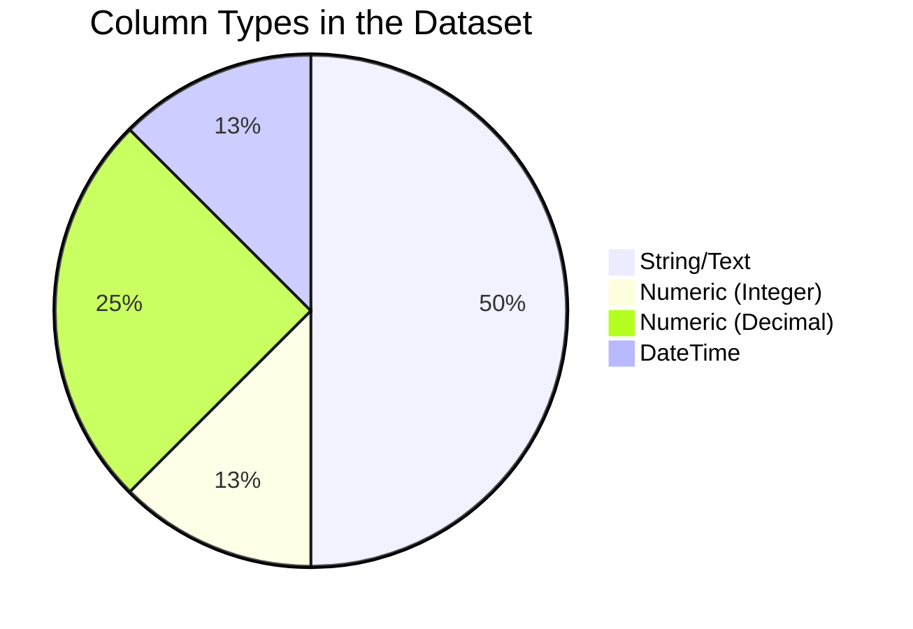
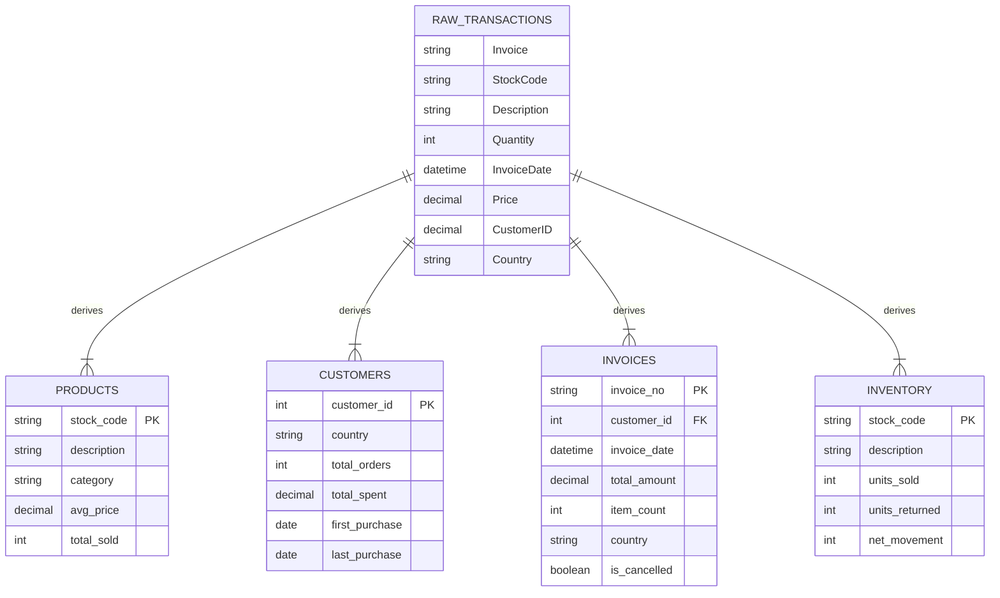

# MarketMind AI — Dataset Structure Analysis

## 1. Dataset Overview

MarketMind AI uses the **Online Retail Transaction Dataset** — a real-world transactional dataset containing all purchases made by customers of a UK-based online retail store. The data spans approximately 2 years and captures international sales of unique all-occasion gifts.

| Property | Value |
|----------|-------|
| **Source** | UCI Online Retail Dataset |
| **Format** | Single CSV/Excel file |
| **Business Type** | UK-based online gift retailer |
| **Time Span** | December 2010 — December 2011 |
| **Geography** | International (38+ countries, primarily UK) |

---

## 2. Schema Details

### Transaction Records (Single Flat Table)

| Column | Data Type | Nullable | Description | Example |
|--------|-----------|----------|-------------|---------|
| `Invoice` | String (ID) | No | Invoice number (6-digit). Prefix 'C' indicates a cancellation/return | 536365 |
| `StockCode` | String (ID) | No | Product/item code (5-digit or alphanumeric) | 85123A |
| `Description` | String | ~0.3% missing | Product name/description | WHITE HANGING HEART T-LIGHT HOLDER |
| `Quantity` | Integer | No | Number of units per transaction. Negative values indicate returns | 6 |
| `InvoiceDate` | DateTime | No | Date and time of transaction | 12/1/2010 8:26 |
| `Price` | Decimal | No | Unit price in GBP (£). Zero values may exist | 2.55 |
| `Customer ID` | Numeric | ~25% missing | Customer number (5-digit) | 17850 |
| `Country` | String | No | Country of customer residence | United Kingdom |

---

## 3. Data Type Distribution



| Data Type | Count | Columns |
|-----------|-------|---------|
| String/Text | 4 | Invoice, StockCode, Description, Country |
| Integer | 1 | Quantity |
| Decimal | 2 | Price, Customer ID |
| DateTime | 1 | InvoiceDate |

---

## 4. Key Observations

### 4.1 Invoice Numbers
- Regular invoices: 6-digit numeric (e.g., `536365`)
- Cancellations/returns: Prefixed with `C` (e.g., `C536379`)
- Each invoice can contain multiple line items (products)
- An invoice represents a single customer transaction/basket

### 4.2 StockCode Patterns
- Most codes are 5-digit numeric (e.g., `71053`, `84406B`)
- Some include letter suffixes (e.g., `85123A`, `84406B`)
- Special codes exist: `DOT`, `POST`, `M`, `BANK CHARGES`, `PADS`, `AMAZONFEE`
- Special codes represent non-product charges and should be filtered during preprocessing

### 4.3 Description Field
- Product names are typically uppercase
- Descriptions provide insight into product categories (gifts, home décor, kitchenware, stationery)
- ~0.3% of records have missing descriptions
- Useful for deriving product categories via text analysis/keyword matching

### 4.4 Quantity
- Positive values: Regular purchases
- Negative values: Returns/cancellations (linked to invoices prefixed with `C`)
- Range: Large negative (returns) to high positive (bulk orders)
- Zero quantities may exist (anomalies)

### 4.5 Price
- Unit price in British Pounds (£ GBP)
- Most products are low-value gifts (£0.50 – £10.00)
- Some high-value items exist (£50+)
- Zero prices exist (likely samples, adjustments, or errors)
- Negative prices may indicate adjustments

### 4.6 Customer ID
- **~25% of records have missing Customer ID** — the largest data quality issue
- Guest/anonymous purchases are not linked to customer accounts
- Customer IDs are 5-digit numbers (e.g., 17850, 13047)
- Critical for segmentation and churn analysis

### 4.7 Country Distribution
- **~90% of transactions are from United Kingdom**
- 38+ countries represented (Germany, France, EIRE, Spain, Netherlands, etc.)
- International orders provide geographic diversity for analysis
- Some entries may have country name variations

---

## 5. Derived Tables (from Flat File)

Since the raw dataset is a single flat transaction table, the following normalized tables must be derived during preprocessing:



---

## 6. Data Quality Summary

| Issue Type | Affected Column | Estimated % | Impact |
|-----------|----------------|-------------|--------|
| Missing values | Customer ID | ~25% | Cannot segment anonymous customers |
| Missing values | Description | ~0.3% | Cannot identify product |
| Negative quantities | Quantity | ~2-3% | Return transactions (valid but need handling) |
| Zero/negative prices | Price | ~1% | Invalid revenue calculations |
| Special stock codes | StockCode | ~0.5% | Non-product entries (postage, fees, adjustments) |
| Duplicate rows | All columns | ~1% | Inflated metrics |
| Cancelled invoices | Invoice (C-prefix) | ~16% | Must separate from valid sales |

---

## 7. Sample Records

```
Invoice | StockCode | Description                          | Quantity | InvoiceDate      | Price | Customer ID | Country
536365  | 85123A    | WHITE HANGING HEART T-LIGHT HOLDER   | 6        | 12/1/2010 8:26   | 2.55  | 17850       | United Kingdom
536365  | 71053     | WHITE METAL LANTERN                  | 6        | 12/1/2010 8:26   | 3.39  | 17850       | United Kingdom
536365  | 84406B    | CREAM CUPID HEARTS COAT HANGER       | 8        | 12/1/2010 8:26   | 2.75  | 17850       | United Kingdom
536366  | 22633     | HAND WARMER UNION JACK               | 6        | 12/1/2010 8:28   | 1.85  | 17850       | United Kingdom
536367  | 84879     | ASSORTED COLOUR BIRD ORNAMENT        | 32       | 12/1/2010 8:34   | 1.69  | 13047       | United Kingdom
```

---

## 8. Comparison: Raw vs Processed Schema

| Aspect | Raw Dataset | After Preprocessing |
|--------|------------|-------------------|
| Tables | 1 (flat) | 4+ (normalized) |
| Columns | 8 | 20+ (with derived features) |
| Returns | Mixed with sales | Separated into own table |
| Categories | None | Derived from descriptions |
| Customer profiles | Just ID + Country | Full RFM profiles |
| Time features | Raw datetime | day_of_week, month, quarter, hour, is_weekend |
| Revenue | Price × Quantity (manual) | Pre-calculated total_amount column |
