# MarketMind AI — Project Objectives & Workflows

## 1. Vision & Mission

**Vision**: Empower small businesses and retail enterprises with AI-driven sales intelligence that transforms raw transaction data into actionable insights, predictive forecasts, and intelligent recommendations.

**Mission**: Build a comprehensive, full-stack sales intelligence platform that democratizes advanced analytics — making customer segmentation, demand forecasting, anomaly detection, and product recommendations accessible to businesses of all sizes without requiring data science expertise.

---

## 2. Core Objectives

### 2.1 Sales Performance Monitoring
- Provide real-time dashboards tracking revenue, order volume, and average order value
- Enable drill-down analysis by product category, store location, time period, and customer segment
- Generate automated sales reports with KPI summaries and trend indicators

### 2.2 Inventory Tracking & Management
- Monitor stock levels across products and warehouse locations
- Trigger automated low-stock and reorder alerts based on configurable thresholds
- Track inventory turnover rates and identify slow-moving or dead stock

### 2.3 Invoice Management
- Generate, track, and manage invoices linked to sales transactions
- Monitor payment status (paid, pending, overdue)
- Produce financial summaries and accounts receivable reports

### 2.4 Customer Behavior Analytics
- Segment customers using AI clustering (K-Means, Hierarchical Clustering)
- Analyze purchasing patterns using RFM (Recency, Frequency, Monetary) metrics
- Profile customer segments for targeted marketing and engagement strategies

### 2.5 AI-Powered Predictive Insights
- **Sales Forecasting**: Predict future revenue and demand using Prophet, XGBoost, and Random Forest models
- **Churn Prediction**: Identify at-risk customers with classification models and recommend retention strategies
- **Product Recommendations**: Deliver personalized product suggestions via collaborative filtering and association rules
- **Anomaly Detection**: Flag suspicious transactions, unusual inventory movements, and revenue outliers

---

## 3. Target Users

| User Type | Examples | Primary Needs |
|-----------|----------|---------------|
| **Retail Stores** | Clothing stores, electronics shops, bookstores | Sales tracking, inventory alerts, customer insights |
| **Supermarkets** | Grocery chains, convenience stores | Demand forecasting, stock management, seasonal analysis |
| **Startups** | E-commerce startups, DTC brands | Customer segmentation, churn prediction, growth analytics |
| **Small Enterprises** | Local businesses, franchises | Revenue analytics, invoice management, recommendations |

---

## 4. Key Workflows

### 4.1 Sales Data Ingestion Pipeline

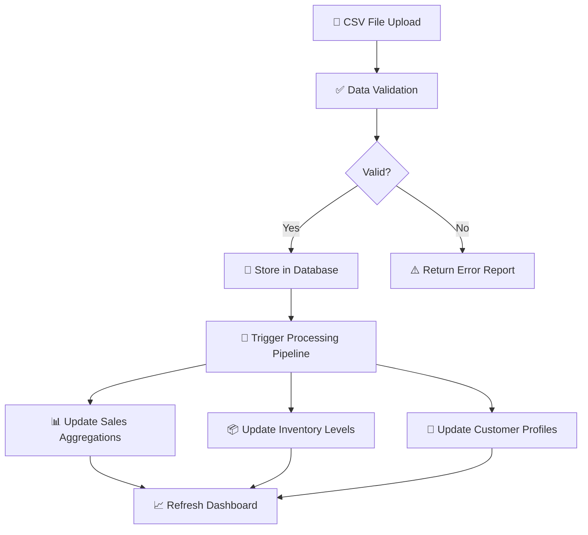

### 4.2 Customer Segmentation Workflow

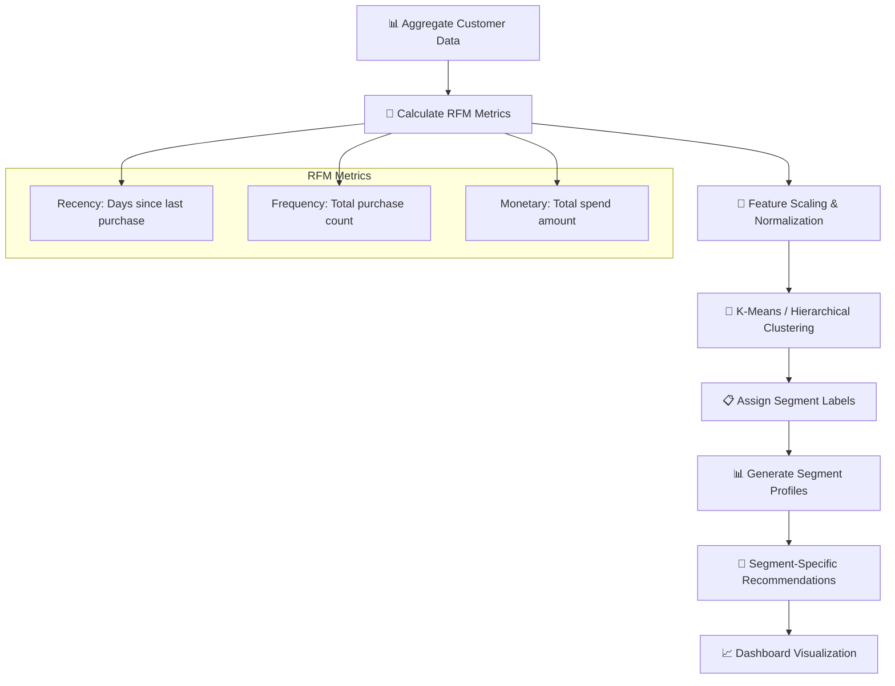

### 4.3 Sales Forecasting Workflow

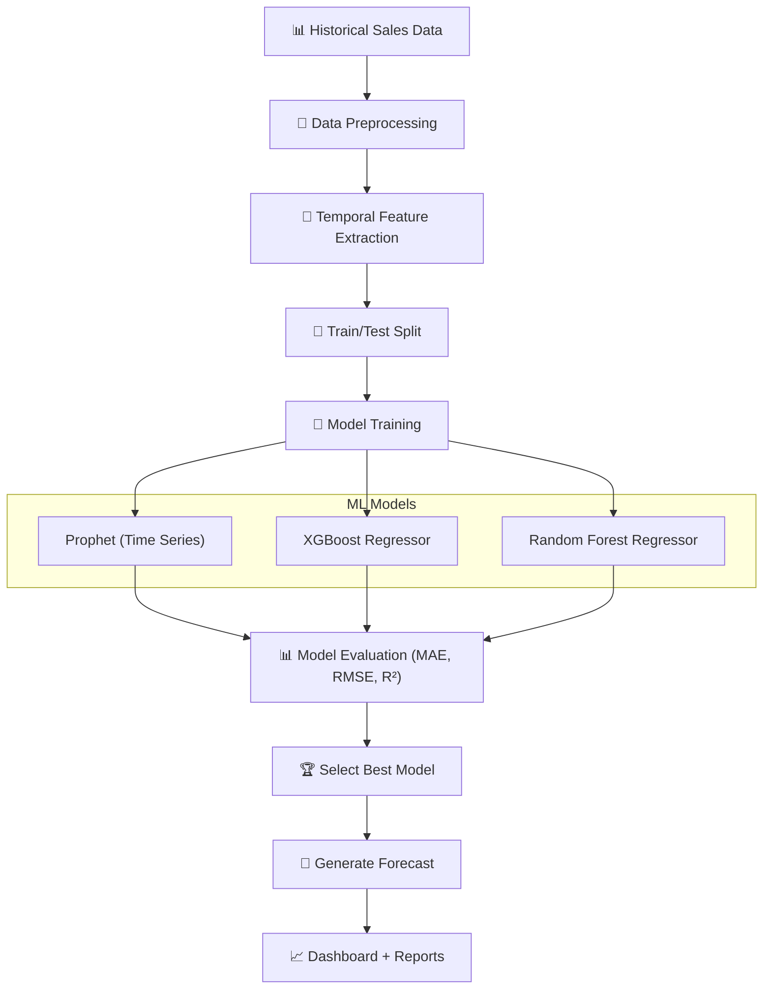

### 4.4 Anomaly Detection Workflow

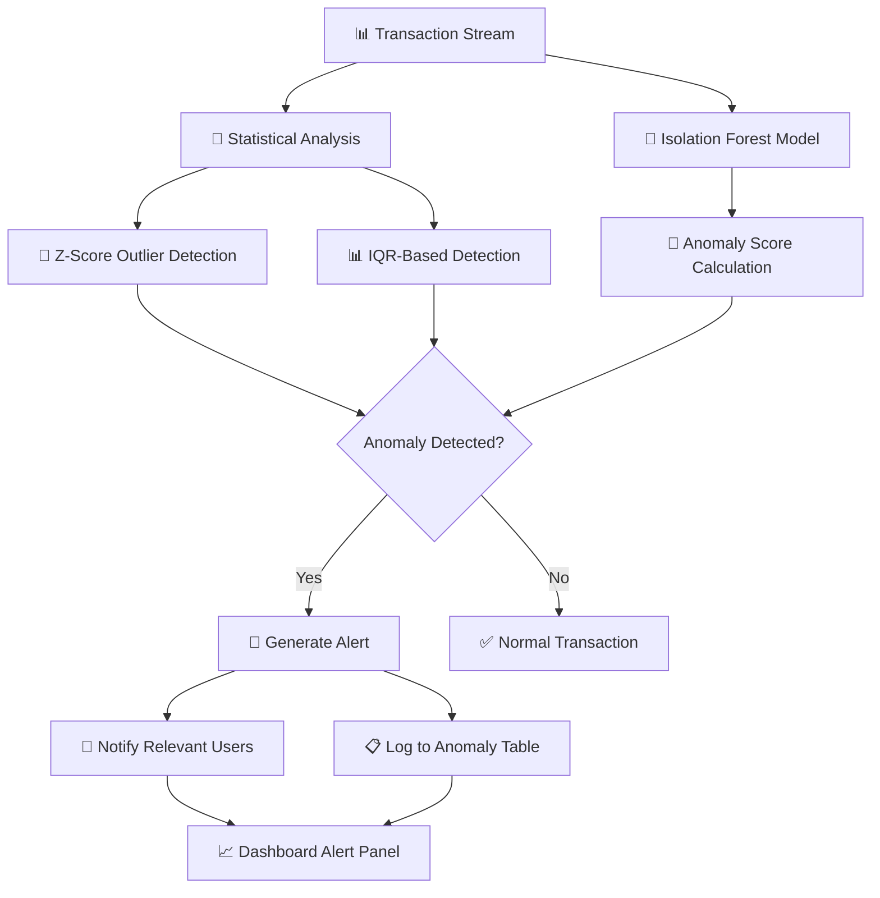

### 4.5 Product Recommendation Workflow

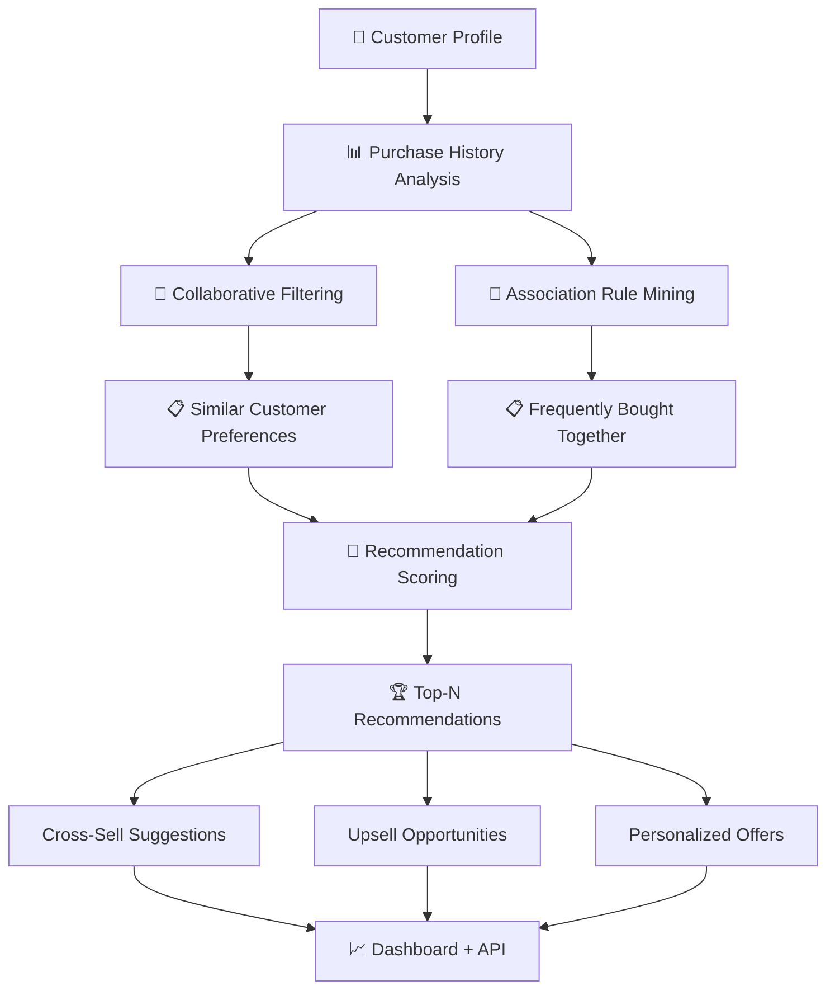

### 4.6 Churn Prediction Workflow

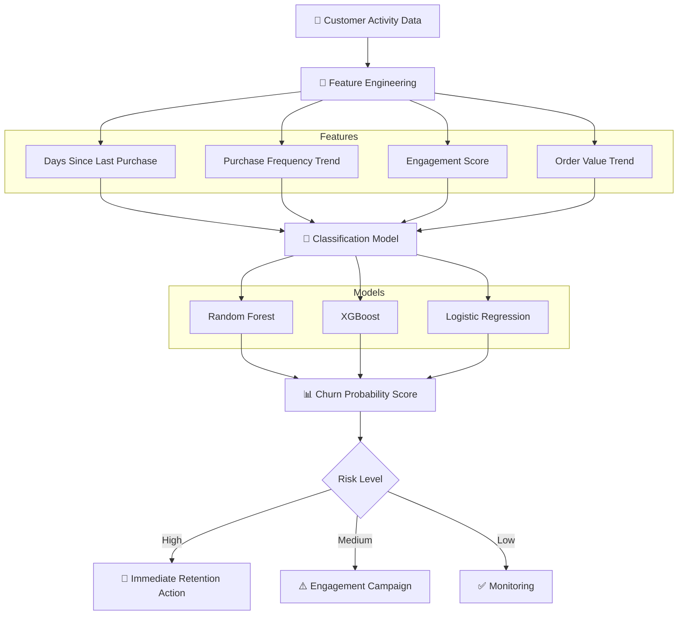

---

## 5. Role-Based Workflows

### 5.1 Business Owner Workflow

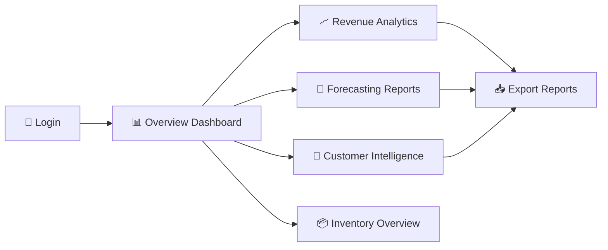

**Key actions**: Monitor KPIs → Review forecasts → Analyze customer segments → Export reports

### 5.2 Store Manager Workflow

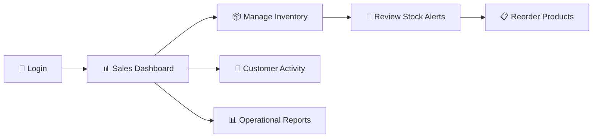

**Key actions**: Check daily sales → Manage inventory → Process reorders → Review customer activity

### 5.3 Sales Executive Workflow

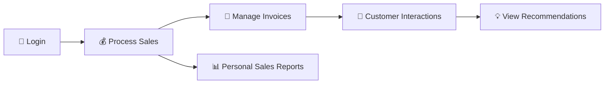

**Key actions**: Process transactions → Create invoices → Track customers → Use recommendations

### 5.4 System Administrator Workflow

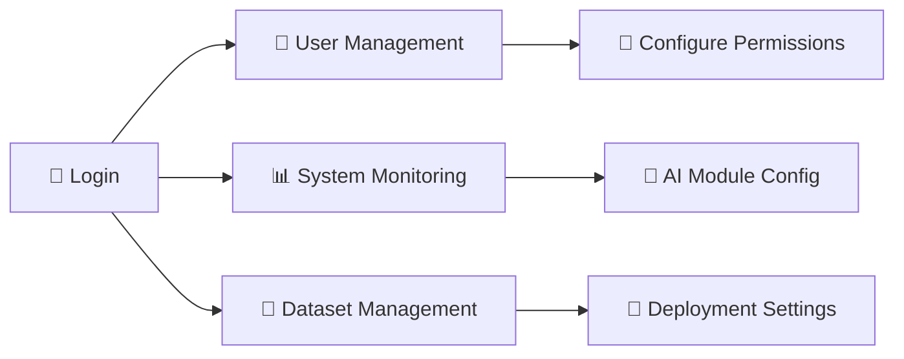

**Key actions**: Manage users → Configure RBAC → Monitor system → Manage AI models

---

## 6. Success Criteria

| Module | Success Criteria | Metric |
|--------|-----------------|--------|
| Sales Dashboard | Real-time KPI display with drill-down | Dashboard load < 2s |
| Inventory Tracking | Automated low-stock alerts | Alert accuracy > 95% |
| Customer Segmentation | Meaningful customer groupings | Silhouette Score > 0.5 |
| Sales Forecasting | Accurate revenue prediction | MAE < 10%, R² > 0.80 |
| Churn Prediction | Identify at-risk customers | F1-Score > 0.75 |
| Recommendations | Relevant product suggestions | Precision@5 > 0.30 |
| Anomaly Detection | Flag suspicious activity | Detection Accuracy > 90% |
| Invoice Management | End-to-end invoice lifecycle | 100% CRUD coverage |
| RBAC | Role-based access enforcement | Zero unauthorized access |

---

## 7. Module Dependency Map

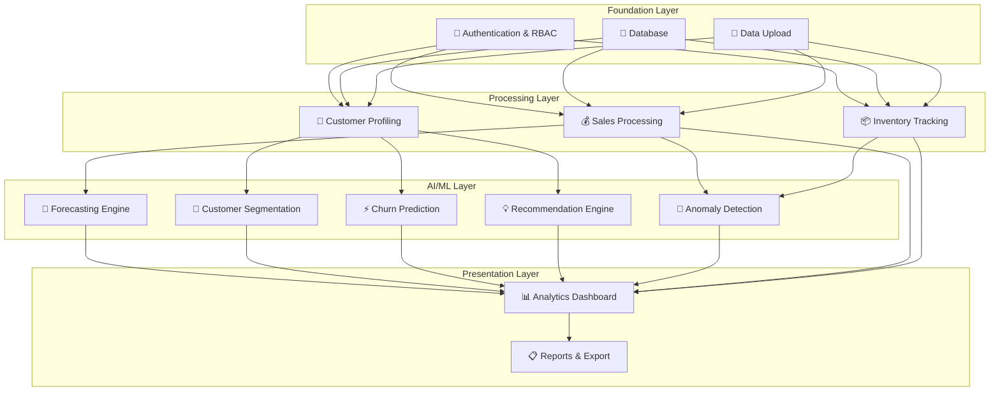
