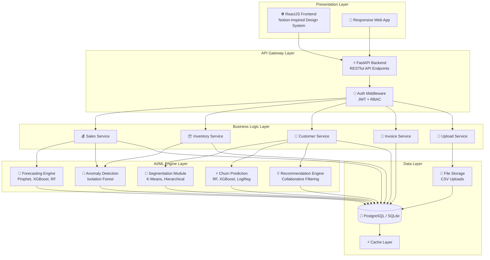
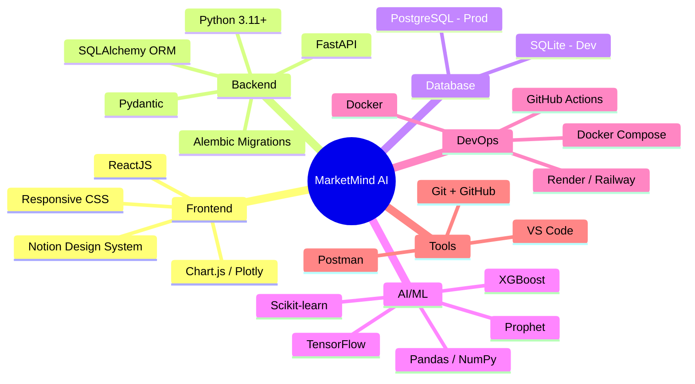
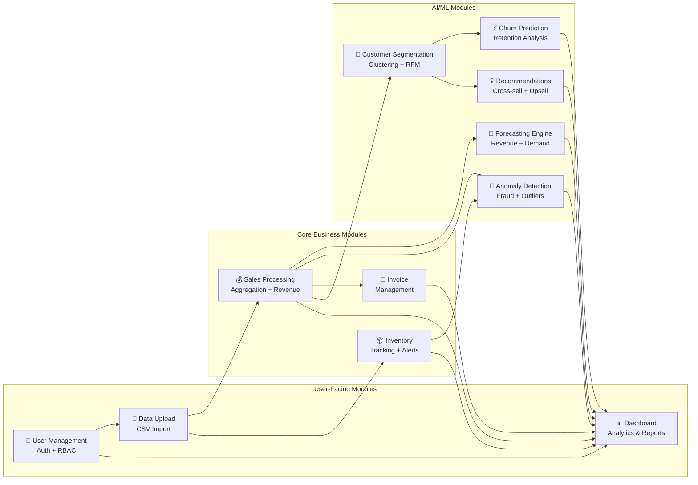
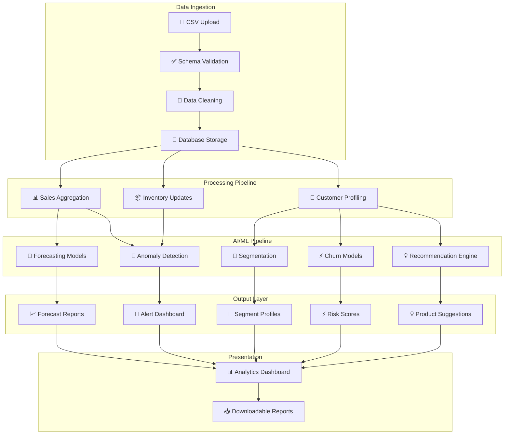
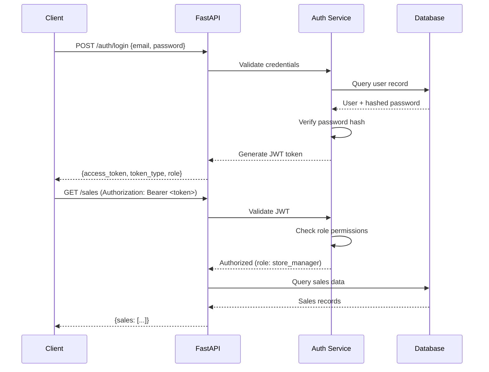
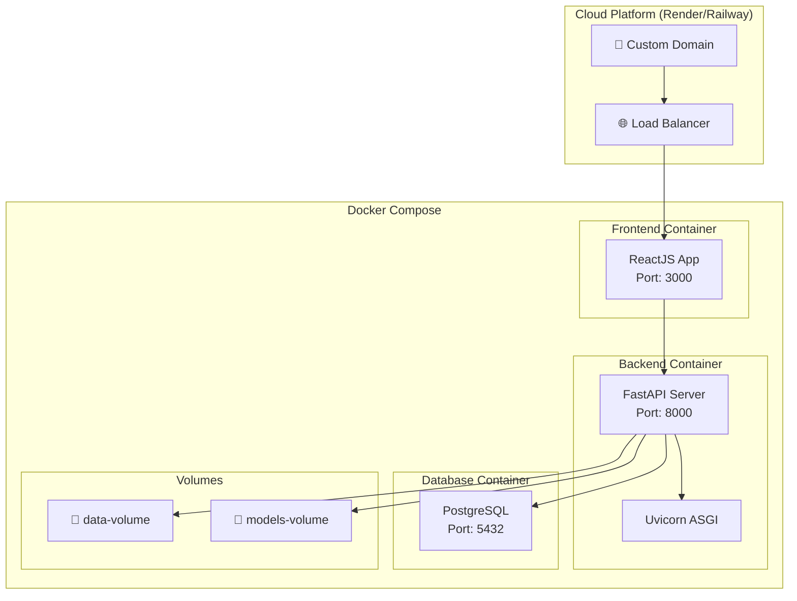

# MarketMind AI — System Architecture

## 1. High-Level Architecture Overview

MarketMind AI follows a **layered architecture** with clear separation of concerns between presentation, API, business logic, AI/ML, and data layers.



---

## 2. Technology Stack



| Layer | Technology | Purpose |
|-------|-----------|---------|
| **Frontend** | ReactJS | Component-based UI framework |
| **Styling** | CSS (Notion Design System) | Consistent, branded UI |
| **Charts** | Chart.js + Plotly | Interactive data visualizations |
| **Backend** | Python FastAPI | High-performance async API server |
| **ORM** | SQLAlchemy | Database abstraction layer |
| **Auth** | JWT + OAuth2 | Stateless authentication |
| **Database (Dev)** | SQLite | Lightweight local development |
| **Database (Prod)** | PostgreSQL | Production-grade relational DB |
| **ML - Forecasting** | Prophet, XGBoost, Random Forest | Time series & regression models |
| **ML - Clustering** | K-Means, Hierarchical | Customer segmentation |
| **ML - Classification** | RF, XGBoost, Logistic Regression | Churn prediction |
| **ML - Recommendations** | Collaborative Filtering, Apriori | Product suggestions |
| **ML - Anomaly** | Isolation Forest, Z-Score | Outlier detection |
| **Deployment** | Docker + Render/Railway | Containerized cloud deployment |
| **API Testing** | Postman | Endpoint validation |
| **Version Control** | Git + GitHub | Source code management |

---

## 3. Module Interaction Diagram



---

## 4. Data Flow Architecture



---

## 5. API Architecture

### 5.1 API Endpoint Structure

```
/api/v1/
├── auth/
│   ├── POST   /register          # User registration
│   ├── POST   /login             # JWT authentication
│   ├── POST   /logout            # Session invalidation
│   └── GET    /me                # Current user profile
│
├── users/
│   ├── GET    /                  # List users (Admin)
│   ├── GET    /{id}              # Get user details
│   ├── PUT    /{id}              # Update user
│   ├── DELETE /{id}              # Delete user (Admin)
│   └── PUT    /{id}/role         # Update role (Admin)
│
├── upload/
│   ├── POST   /sales             # Upload sales CSV
│   ├── POST   /inventory         # Upload inventory CSV
│   ├── POST   /customers         # Upload customer CSV
│   └── GET    /history           # Upload history
│
├── sales/
│   ├── GET    /                  # List transactions
│   ├── GET    /{id}              # Transaction details
│   ├── POST   /                  # Create transaction
│   ├── GET    /summary           # Sales aggregations
│   ├── GET    /trends            # Sales trends
│   └── GET    /by-category       # Category breakdown
│
├── inventory/
│   ├── GET    /                  # List inventory
│   ├── GET    /{id}              # Product stock details
│   ├── PUT    /{id}              # Update stock
│   ├── GET    /alerts            # Low-stock alerts
│   └── GET    /turnover          # Turnover analysis
│
├── customers/
│   ├── GET    /                  # List customers
│   ├── GET    /{id}              # Customer profile
│   ├── GET    /{id}/history      # Purchase history
│   └── GET    /segments          # Segment summary
│
├── invoices/
│   ├── GET    /                  # List invoices
│   ├── GET    /{id}              # Invoice details
│   ├── POST   /                  # Create invoice
│   ├── PUT    /{id}/status       # Update payment status
│   └── GET    /summary           # Invoice summary
│
├── ai/
│   ├── GET    /forecast/revenue  # Revenue forecast
│   ├── GET    /forecast/demand   # Demand forecast
│   ├── GET    /segments          # Customer segments
│   ├── GET    /churn/scores      # Churn probabilities
│   ├── GET    /churn/at-risk     # At-risk customers
│   ├── GET    /recommendations/{customer_id}  # Product recs
│   ├── GET    /anomalies         # Detected anomalies
│   └── POST   /retrain           # Retrain models (Admin)
│
└── reports/
    ├── GET    /sales              # Sales report
    ├── GET    /inventory          # Inventory report
    ├── GET    /customers          # Customer report
    ├── GET    /forecast           # Forecast report
    └── GET    /download/{type}    # Export as CSV/PDF
```

### 5.2 Authentication Flow



---

## 6. Deployment Architecture



### Docker Compose Configuration

```yaml
# docker-compose.yml (planned)
version: "3.9"
services:
  frontend:
    build: ./frontend
    ports:
      - "3000:3000"
    depends_on:
      - backend

  backend:
    build: ./backend
    ports:
      - "8000:8000"
    environment:
      - DATABASE_URL=postgresql://user:pass@db:5432/marketmind
      - JWT_SECRET=<secret>
    depends_on:
      - db
    volumes:
      - data-volume:/app/data
      - models-volume:/app/models

  db:
    image: postgres:15
    ports:
      - "5432:5432"
    environment:
      - POSTGRES_DB=marketmind
      - POSTGRES_USER=user
      - POSTGRES_PASSWORD=pass
    volumes:
      - pgdata:/var/lib/postgresql/data

volumes:
  pgdata:
  data-volume:
  models-volume:
```

---

## 7. Project Directory Structure

```
marketmind/
├── frontend/                  # ReactJS Application
│   ├── public/
│   ├── src/
│   │   ├── components/       # Reusable UI components
│   │   ├── pages/            # Route-level pages
│   │   ├── services/         # API client services
│   │   ├── context/          # React context (auth, theme)
│   │   ├── hooks/            # Custom hooks
│   │   ├── styles/           # CSS (Notion design tokens)
│   │   └── utils/            # Utility functions
│   ├── package.json
│   └── Dockerfile
│
├── backend/                   # FastAPI Application
│   ├── app/
│   │   ├── api/              # API route handlers
│   │   │   ├── auth.py
│   │   │   ├── sales.py
│   │   │   ├── inventory.py
│   │   │   ├── customers.py
│   │   │   ├── invoices.py
│   │   │   ├── upload.py
│   │   │   ├── ai.py
│   │   │   └── reports.py
│   │   ├── models/           # SQLAlchemy models
│   │   ├── schemas/          # Pydantic schemas
│   │   ├── services/         # Business logic
│   │   ├── ml/               # AI/ML modules
│   │   │   ├── forecasting.py
│   │   │   ├── segmentation.py
│   │   │   ├── churn.py
│   │   │   ├── recommendations.py
│   │   │   └── anomaly.py
│   │   ├── core/             # Config, security, deps
│   │   └── main.py           # FastAPI app entry
│   ├── requirements.txt
│   └── Dockerfile
│
├── data/
│   ├── raw/                  # Original CSV datasets
│   └── processed/            # Cleaned datasets
│
├── scripts/                  # Utility scripts
│   ├── generate_datasets.py
│   └── preprocess.py
│
├── docs/                     # Documentation
├── wireframes/               # UI wireframes
├── models/                   # Trained ML models
├── docker-compose.yml
├── .env.example
├── .gitignore
└── README.md
```

---

## 8. Security Architecture

### 8.1 Authentication
- **JWT (JSON Web Tokens)** with short-lived access tokens (15 min) and refresh tokens (7 days)
- **Password hashing** with bcrypt (12 rounds)
- **Rate limiting** on auth endpoints (5 attempts per minute)

### 8.2 Authorization (RBAC)
- Four predefined roles: `business_owner`, `store_manager`, `sales_executive`, `admin`
- Permission matrix enforced at API middleware level
- Role-based dashboard view filtering

### 8.3 Data Security
- HTTPS/TLS encryption in transit
- Database connection encryption
- Input validation with Pydantic schemas
- SQL injection prevention via ORM
- CORS policy configuration
- CSV upload size limits and type validation
